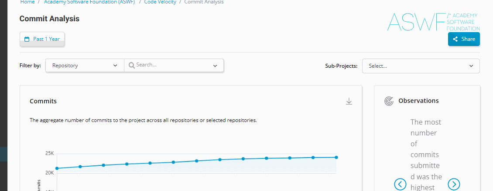
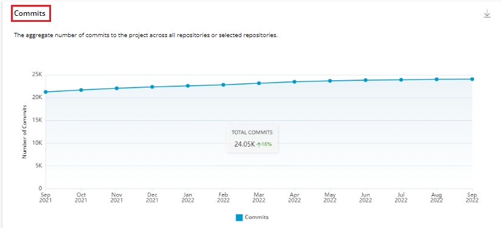
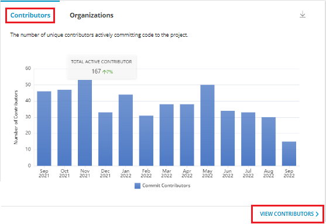
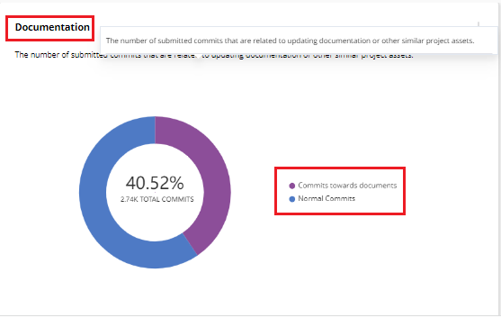

# Commit Analysis

Commit Analysis provides various insights related to the commits carried out for the open source project. Commit Analysis provides various graphs that provides you information on commit analysis. There are various graphs such as:

* Total number of commits
* Commit Trends &#x20;
* Contributors / Organization&#x20;
* Code Changes
* Documentation&#x20;
* Pair Programing Commits&#x20;
* Code by Day&#x20;
* Programming Languages&#x20;
* Commit-To- Merge Time
* Top 10 Contributors&#x20;
* Top 10 Organizations&#x20;

## Filter Data by Time Range

You can filter the data related to commit analysis as per your desired date range. By default, time range is **Past 1 Year**. You can change the time range for a certain time period. For more information, refer [Date Range](https://docs.linuxfoundation.org/lfx/insights/v2-current/project-trends/filter-data-by-time-range).&#x20;

## Filters

You can filter the commit analysis using various other filter like:

* Filter by&#x20;
  * Repository&#x20;
  * Repository Tags
* Searching by various individual repositories &#x20;
* Sub Projects


Every dashboard has a filter at the top of the dashboard to select either **Repositories or Repository Tags**. \
\
A Repository tag is a logical group created by clubbing two or more repositories under an org. One repository can belong to multiple repository groups. A repository tag is unique to a project.


<figure><figcaption>
Filters 
</figcaption></figure>

## Download of Charts&#x20;

You can download all the charts that are displayed in the Commit Analysis page by click of the download icon that is provided on top of all the charts. The downloaded chart is saved on your local drive in the PNG format.&#x20;

## Total Number of Commits

This line graph provides the count of the total number of commits aggregated since the start of the project analyzed over the selected time period.&#x20;

<figure><figcaption>
Total Number of Commits 
</figcaption></figure>

## Observations&#x20;

Observations window provides various observations carried out on the commit analysis.  Some  of the observations that are displayed are listed in the following list:

* The percentage change in the number of commits increased/decreased during the selected time period.
* The most number of commits submitted was the highest during X-Y period.


For computing the average commits, only the unique commits submitted during the selected time period should be considered and averaged out based on the data points (buckets) on the graph.


## Commit Trends&#x20;

This bar graph provides the total number of commits performed during the selected time period. Hover over the bar to see the total commits for that particular months. The annotation block show the total commits for the selected period and the rate of change compared to previous time period.

<figure><figcaption>
Commit Trends 
</figcaption></figure>

## Contributors Commits

This bar graph provides the total number of number of unique contributors actively committing code to the project during the selected time period.


On click of **View Contributors**, you can view the list of people contributing to the project. For more, refer [People](https://docs.linuxfoundation.org/lfx/insights/v2-current/all-projects/community-analytics/people-analytics).&#x20;


<figure><figcaption>
Contributors Commits
</figcaption></figure>

## Organization Commits&#x20;

This bar graph provides the total number of number of unique organizations actively committing code to the project during the selected time period.

<figure><figcaption>
Organization Commits 
</figcaption></figure>

## Code Changes&#x20;

This line graph provides the count of the total number of commits pushed and analyzed by those containing actual lines of code changes vs those that are empty or identified as merge commits.

<figure><figcaption>
Code Changes
</figcaption></figure>

## Documentation&#x20;

This donut chart provides you the total number of commits that are intended to update documentation or assets like images for the project.

<figure><figcaption>
Documentation 
</figcaption></figure>

## Pair Programming Commits

This line graph provides the total count of the number of commits signed-off by more than one author.


* Pair Programming are enabled by default and are identified by the parsing the git trailers for more than one Author, generally given by 'Co-Authored' or 'Signed-off by' trailers.
* A co-author should be different that the actual author of the commit, hence pair programming commits should be not identified by merely looking at multiple occurrences of the git trailers and rather by also checking the authors and co-authors involved in the commit and tag a commit as pair programming commit only if both are different individuals.


<figure><figcaption>
Pair Programming Commits
</figcaption></figure>

## Code by Day

This radar chart provides you the total commits submitted and aggregated across each day of the week.


* The aggregation applies to only commits submitted during the selected time period.
* Only commits authored or co-authored are considered.&#x20;


<figure><figcaption>
Code by Day
</figcaption></figure>

## Programming  Languages

This bubble chart provides you the total number of programming languages used across the commits submitted and determined by analyzing the files (checking the extensions) modified or added for each commit.&#x20;


If a file type cannot be determined, it is marked as  'Unknown'.


<figure><figcaption>
Programming Languages
</figcaption></figure>

## Commit-To-Merge Time&#x20;

This speedometer chart provides you the  average time, in days, for a commit to be committed to a branch. For each commit, the efficiency is computed by taking the difference between the time it was added and the time it was committed.

<figure><figcaption>
Commit-To-Merge Time
</figcaption></figure>

## Top 10 Contributors&#x20;

This list provides you the details of the top 10 contributors for the project in last one  year. The top contributor of the project is calculated based on the commits submitted on the project.&#x20;

This list provides various details such as:

* Display name&#x20;
* System name&#x20;
* Organization  name&#x20;
* Last activity&#x20;
* Commits authored
* Commits co-authored
* LOC added
* LOC deleted&#x20;
* Files modified&#x20;


* You can order the list based on commits authored, commits co-authored, LOC added, LOC deleted and Files modified.&#x20;
* On Click of **View All**, all the contributors of the project are listed. &#x20;


<figure><figcaption>
Top 10 Contributors 
</figcaption></figure>

## Top 10 Organizations

This list provides you the details of the top 10 organizations that contributing to the  the project in last one year. The top organization of the project is calculated based on the commits submitted on the project.&#x20;

This list provides various details such as:

* Organization name&#x20;
* Organization Logo &#x20;
* Contributors&#x20;
* Last activity&#x20;
* Commits authored
* Commits co-authored
* LOC added
* LOC deleted&#x20;
* Files modified&#x20;


You can order the list based on commits authored, commits co-authored, LOC added, LOC deleted and Files modified.&#x20;


<figure><figcaption>
Top 10 Organizations 
</figcaption></figure>
