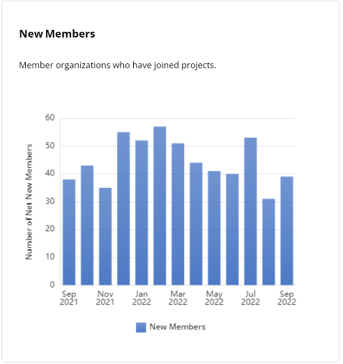

# New Members

The **New Members** dashboard shows bar graphs that display a periodic increase or decrease in the number of new members during a selected time period. Hover over a bar on the chart to view the number of new members who joined the Linux Foundation for the first time, by date.

For more information about new members, see [Glossary](../../glossary.md#undefined). The graph displays the organizations that initially signed up for LF membership within the given time period for the total number of new members.

<figure><figcaption>
New Members
</figcaption></figure>
