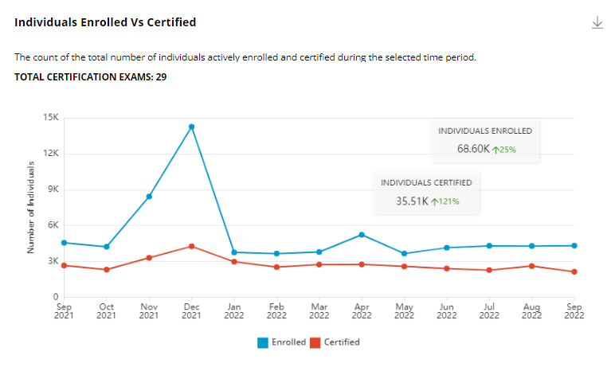

# Individuals Enrolled vs. Certified

This metric shows dual-colored line graphs that increase or decrease in the number of individuals actively enrolled and certified during the selected time period. Hover over a graph point to view the number of individuals enrolled and certified during a particular time period.


* The blue-colored line represents individuals enrolled in the certification programs.
* The green-colored line represents individuals who are certified by the programs.


The annotation blocks show:

* Total number of individuals enrolled in certification courses during the selected time period.
* The increment or decrement rate of change in the number of individuals enrolled in certification courses during the selected time period compared to the previous time period.
* The total number of individuals certified during the selected time period.
* The increment or decrement rate of change in the number of individuals certified during the selected time period compared to the previous time period.

### Observations

The Observations slide shows the following information:

* The average number of individuals who are enrolled in certification courses during the selected time period.
* The average number of individuals who are certified during the selected time period.
* The increment or decrement rate of change (in percentage) in the number of individuals enrolled compared to the preceding period.
* The increment or decrement rate of change (in percentage) in the number of individuals certified compared to the preceding period.

<figure><figcaption>
Enrolled vs. Certified
</figcaption></figure>
