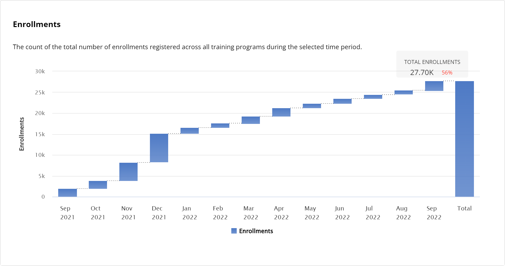

# Enrollments

The bar chart shows a periodic increase or decrease in the total number of enrollments registered across all training programs during the selected time period. Hover over a bar to view the number of enrollments for all the training programs in particular month.

This metric shows:

* The average number of enrollments registered across all training programs during the selected time period.
* The increment or decrement rate of change in the number of enrollments registered across all training programs during the selected time period compared to the previous time period.

<figure><figcaption>
Total enrollments 
</figcaption></figure>

### Observations

The Observations slide shows the following information:

* The average number of seats that were enrolled across all training programs during the selected time period.
* The time period during which the greatest number of enrollments were registered across all training programs.
