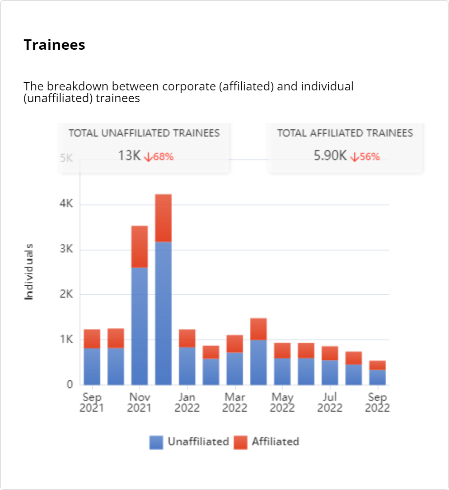

# Trainees

The **Trainees** dashboard shows the total number of learners actively enrolled in training programs over the selected time period. The horizontal segmented chart shows the ratio of affiliated and unaffiliated trainees.

On the dashboard, you can analyze the following data:

* Monthly statistics of affiliated and unaffiliated trainees.
* Total increase or decrease of affiliated and unaffiliated trainees.

<figure><figcaption>
Number of trainees
</figcaption></figure>

