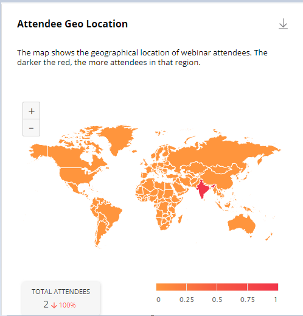

# Attendee Geo Locations

An interactive, **Geo Locations** dashboard presents the geographical distribution of webinar attendees and their drop rate. The Geo Location dashboard shows a map of the world combined with a heat map. The darker shade of color indicates a higher value for the metric.

The following metrics are available for analysis on the map:

* **Webinar attendees:** the number of authentic webinar attendees.
* **Total Attendees:** the attendance rate increased or decreased by X% compared to the previous time.

The world map with different colors for different regions (countries) represents how many individuals participated in the webinars, by country, that were organized during the selected time period. Hover over a color or a country to view the number of individuals who attended the webinars that were conducted during the selected time period.

<figure><figcaption>
Attendees Geo Locations dashboard
</figcaption></figure>
