# People Analytics

People Analytics provides various insights with respect to a community within a project. It provides the following insights related to a community:

* A slider widget
* Tabular view of contributors
* Visual view of contributors

Contributors dashboard provides an analytics of affiliations and identities of technical contributors within the community, and allow community managers to make necessary changes to affiliations and identities of the technical contributors.

**To view contributors dashboard:**

1.Sign in to [Insights](https://insights.lfx.linuxfoundation.org/projects).

2.From left side navigation pane, search for a project by typing the project name in the search bar, Or click **All Projects**, and then click **VIEW PROJECT** on the project card.


By default, **Trends** page is displayed.


3.Under **Community Analytics**, click **People**.

<figure><figcaption>
People
</figcaption></figure>

## Date Range 

Default time to filter data is Past 1 Year. You can filter dashboard data by [making changes to the time range](https://docs.linuxfoundation.org/insights-v2-and-community-management/trends/filter-data-by-time-range).

## Slider Widgets 

The Slider widget provides you information related to the following:

* Total contributors
* Individual contributors&#x20;
* Corporate contributors

<figure>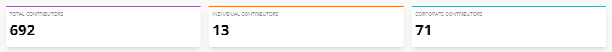<figcaption>
Slider Widget
</figcaption></figure>

#### **Total Contributors** 

It shows the total number of unique profiles (with or without LFIDs) across all sources that includes contributors from committees, meetings and membership contacts for the selected project or project group. Profiles without LFIDs are calculated unique based on the unique email addresses associated with the profiles.

#### **Corporate Contributors** 

It shows the number of those contributors who either have confirmed their project affiliation with an organization or have been affiliated (by a community manager) to some organization on their Individual (My Profile) dashboard.

#### **Individual Contributors** 

It shows the number of those contributors who either have not added their organization affiliation or have been auto affiliated as _Individual Contributors_ (due to missing organization affiliation) for the selected project.

## Filters for Dashboard 

You can filter the dashboard using various parameters such as Most Active, New & Promising, Drifting Away, Everyone, and Search by.

### Filter by Most Active 

Most Active contributors are those who have actively contributed to the project within last one month.

To filter the dashboard by Most Active profiles, perform the following steps:

1.Click **Show Filters**. List of filters appears.

<figure>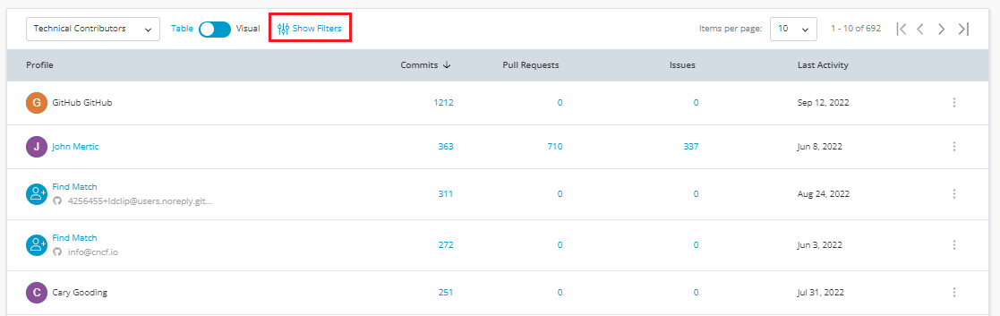<figcaption>
Show Filters
</figcaption></figure>

2.Click **Most Active** filter. The dashboard is filtered by most active profiles.

<figure>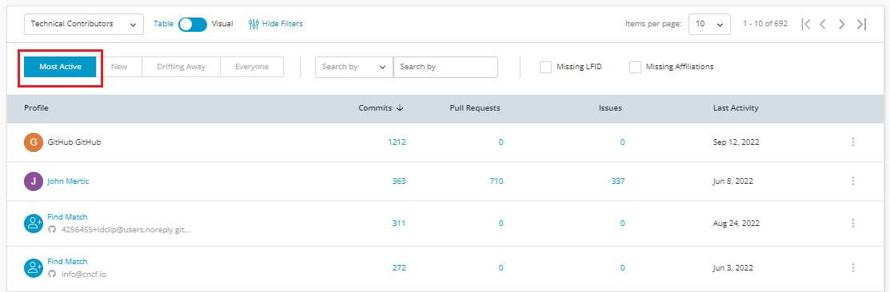<figcaption>
Most Active 
</figcaption></figure>

### Filter by New 

New contributors are those who have contributed to the project for the first time over last one month time period.

To filter the dashboard by New profiles, perform the following steps:

1.Click **Show Filters**. List of filters appears.

2.Click **New** filter. The dashboard is filtered by new profiles.

<figure>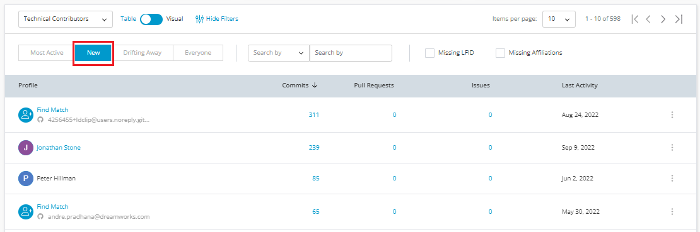<figcaption>
New
</figcaption></figure>

### Filter by Drifting Away 

Drifting Away contributors are those contributors who were active contributors one year back and they have not contributed to the project within the last year.

To filter the dashboard by Drifting Away profiles, perform the following steps:

1.Click **Show Filters**. List of filters appears.

2.Click **Drifting Away** filter. The dashboard is filtered by drifting away profiles.

<figure><figcaption>
Drifting Away 
</figcaption></figure>

### Filter by Everyone 

Everyone contributors are those who are all contributing to projects irrespective whether they are active, passive, new or drifting contributors.

To filter the dashboard by Everyone profiles, perform the following steps:

1.Click **Show Filters**. List of filters appears.

2.Click **Everyone** filter. The dashboard is filtered by all profiles.

<figure>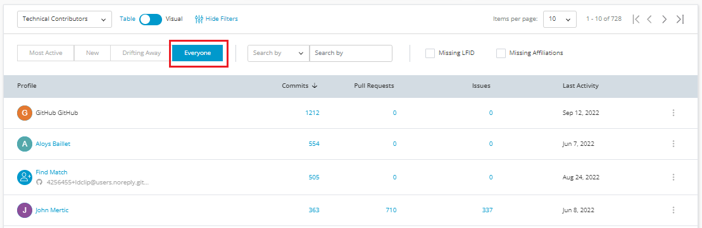<figcaption>
Everyone
</figcaption></figure>

## Search 

You have an option to search a contributor using the following ways:

* Search by name
* Search by email
* Search by organization

To search the contributor, perform the following steps:

1.Click **Show Filters**. List of filters appears.

2.Select the required way of searching a contributor from the drop down list.&#x20;

* Enter the name of the contributor if you have selected **Name**.
* Enter the email ID of the contributor if you have selected **Email**.
* Enter the organization name of the contributor if you have selected **Organization**.

<figure><figcaption>
Search a contributor 
</figcaption></figure>

## Technical Contributors with Missing LFID 

You can list group of technical contributors who have not created the LFID. This list will help to identify the technical contributors who does not have LFID.

To list group of contributors who does not have LFID, perform the following steps:

1.Click **Show Filters**. List of filters appears.

2.Select the **Missing LFID** check box.

<figure>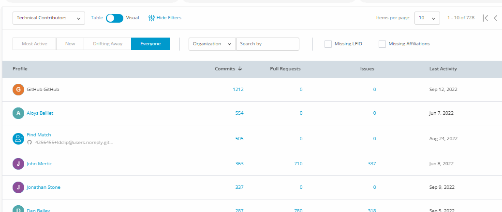<figcaption>
Missing LFID List
</figcaption></figure>

## Technical Contributors with Missing Affiliations 

You can list group of technical contributors where the affiliations are missing. This list will help to identify the technical contributors who does not have any affiliations.

To list group of contributors who does not have LFID, perform the following steps:

1.Click **Show Filters**. List of filters appears.

2.Select the **Missing Affiliations** check box.

<figure>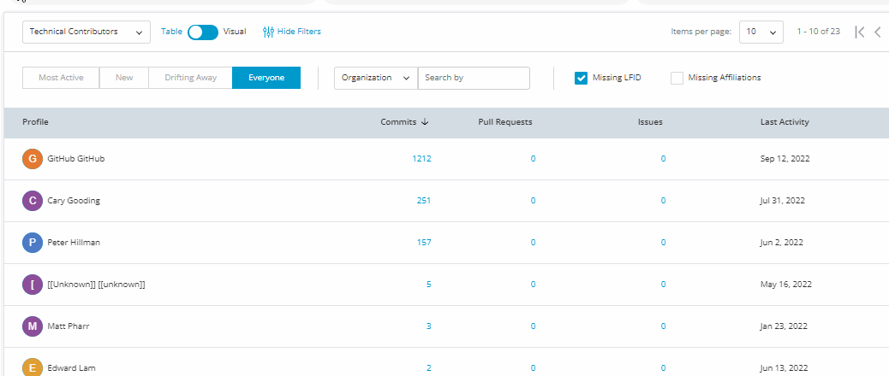<figcaption>
Missing Affiliation 
</figcaption></figure>

## Pull Requests by Contributors 

You can check the pull request submitted, reviewed, merged and comments from an individual contributor on click of **Pull Request**.

<figure>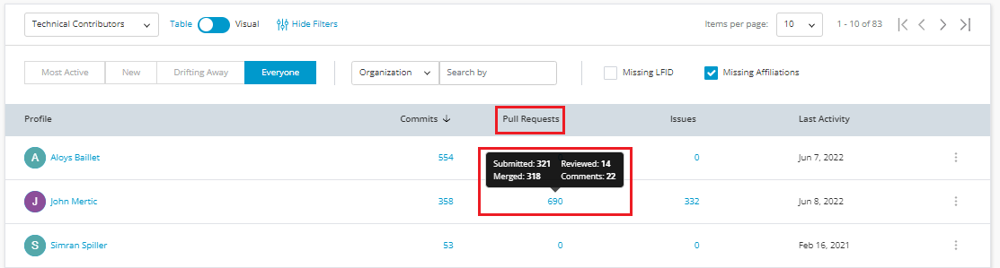<figcaption>
Pull Request
</figcaption></figure>

## Commits by Contributors 

You can check the commits from the contributors for the project. Click **Commits** to check lines of codes added, lines of code deleted, and lines of codes co-authored.

<figure>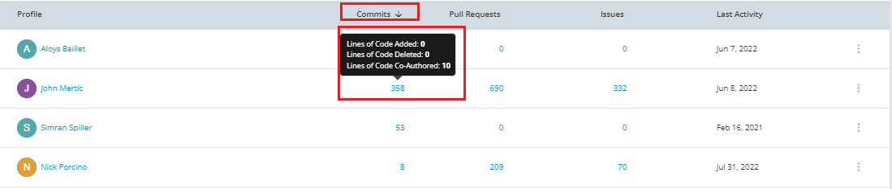<figcaption>
Commits
</figcaption></figure>

## Issues Raised by Contributors 

You can check issues raised from the contributors for the project. Click **Issues** to check issues submitted, closed and commented on the issues.

<figure>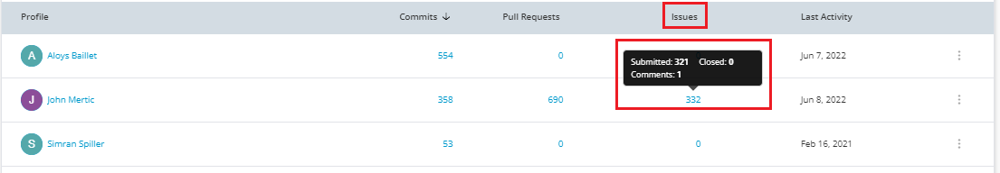<figcaption>
Issues
</figcaption></figure>

## Emailing a Contributor 

You have an option to send an email to the contributor by clicking the Eclipsys  icon and selecting the **Send a Message**. You can send the email to the contributor in case you want to appreciate the contributor on their contributions or else you can also send the email to the drifting away contributors on informing about the latest development on the project.

<figure><figcaption>
Send Message
</figcaption></figure>

## View Organization Snapshot of a Contributor 

You can view the organization snapshot of a contributor by click of **View Organization Snapshot** available under the Organization column.

The Organization snapshot provides a snapshot of the following details such as:

* Organization details such as organization name, logo, website and Linkedin profile link.
* Total contributions
* Total contributors
* Contributors with LFID
* Contributors without LFID
* Last activity date
* Industry segment of the organization
* Contribution line chart for last six months
* Related projects

## Finding a Match 

## Managing Identities (Claimed and Merge Identities) 

## Add Affiliation 

## Calculating Community Management Metrics

Community Management Metrics is derived based on the number of commits submitted, number of pull requests managed and total number of issues submitted and closed for a project.&#x20;

<figure>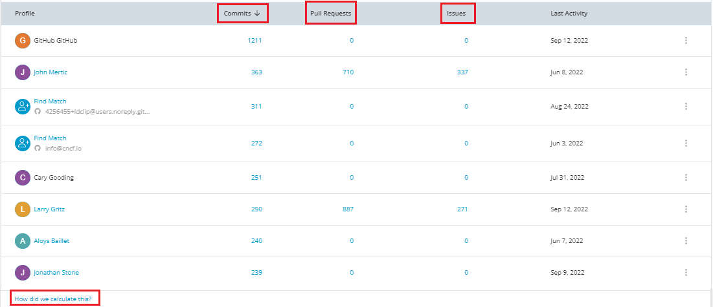<figcaption>
Community Management Metrics
</figcaption></figure>


For the current release, GitHub and Git are the two data sources used to calculate commits and pull requests. GitHub is the data source to calculate issues.&#x20;


### **Commits**&#x20;

A commit is an operation which sends the latest changes of the source code to the repository, making these changes part of the head revision of the repository.

Commits includes the following:

* Commits Authored: These are the number commits where the author of the commit is the selected user. The number is a hyperlink and on click opens a modal that shows the LOC ++ (added) and LOC --(deleted)
* Commits Co-Authored: These are the number commits where the user has been a co-author.

On click of the **Commits**, you can view the following details:

* Lines of code added
* Lines of code deleted
* Lines of code co-authored

<figure><figcaption>
Commits
</figcaption></figure>

A commit in GitHub is an individual change which has been been done on a single or group of files. When you make a commit to save your work for a file, GitHub creates a unique ID (which is "SHA" or "hash") that allows you to keep record for the specific changes committed along with when and who made those changes.

A commit in Git can be thought of as snapshots or milestones along the timeline of a Git project. Commits are created with the git commit command to capture the state of a project at that point in time.

**Commit Process**

Visit the [GitHub Commit process](https://github.com/git-guides/git-commit) link for more information.&#x20;

### **Pull Requests**

Pull requests (PR) is a mechanism for a developer to notify team members that they have completed a feature. Once a pull request is sent, other members can look over your code. The pull request can be marked for review, and engineering team can add questions or comments to it. Eventually, a project maintainer will decide whether or not the pull request should merge with the rest of the code.


In GitHub, we use the term Pull Request and in Gerrit, we refer it as Changesets.&#x20;


On click of **Pull Request,** you can view the following details:

* Submitted
* Reviewed
* Merged
* Comments&#x20;

<figure><figcaption>
Pull Requests 
</figcaption></figure>

**Pull Request Process**&#x20;

Follow the below steps to create Pull Request (PR) for  a project:

1. Search for the required project for which want to contribute to.
2. Fork the project.&#x20;
3. Clone the project to your local system.
4. Create a new branch.
5. Update your changes.
6. Push the changes back to your repo.
7. Click the **Compare & pull request** button.
8. Click **Create pull request** to open a new pull request.

**Issues**

Issues allows you track defects and issues that are available in the project. Tracking of issues helps in completion of the project with out any defects or issues. Issues are important because the first step when a contributor visit the project site is to find an issue one would like to work on and which they think is suitable for their skill set.

On click of **Pull Request,** you can view the following details:

* Issues submitted
* Issues closed (resolved + done + completed + rejected)
* Issues comments

<figure>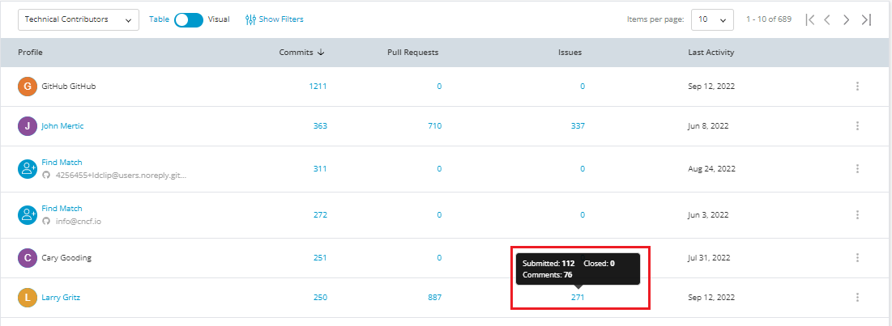<figcaption>
Issues 
</figcaption></figure>

