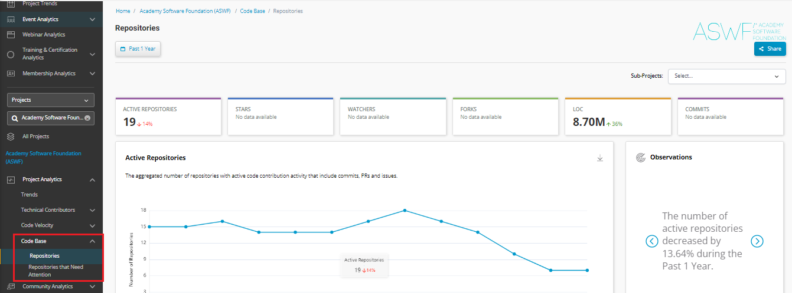

# Code Base

Code Base tab provides various insights related to the code repositories that are available with various open source project.&#x20;

Code Base tab provides insights on the following:

* Repositories&#x20;
* Repositories that need Attention &#x20;

## Accessing Code Base

To access Code Base, perform the following steps:

1.Login to Insights.&#x20;

2.On the vertical sidebar navigation menu, click **Code Base**.

<figure><figcaption>
Code Base
</figcaption></figure>
