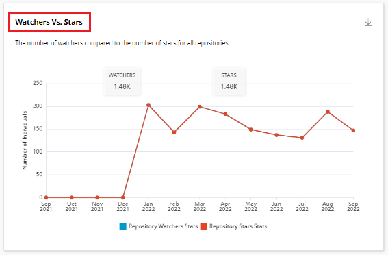
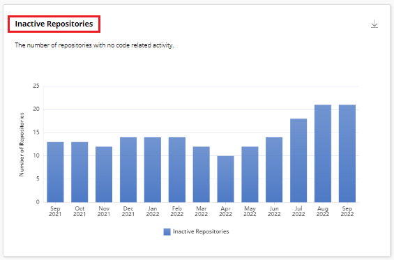
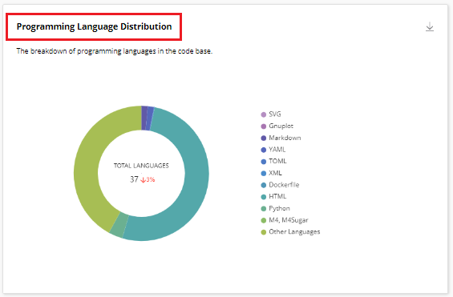
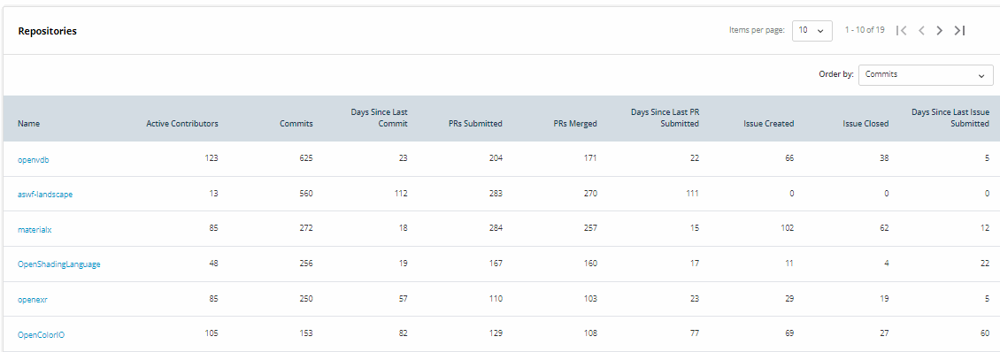

# Repositories

A repository is one which contains all of your project's files and each file's revision history. Repositories provides various insights related to the code repositories that are used in the open source project. Repositories provides various graphs that provides you information on different aspects of the repositories. There are various graphs such as:

* Active Repositories&#x20;
* Watchers Vs Stars&#x20;
* Forks&#x20;
* Inactive Repositories&#x20;
* Programming Language Distribution&#x20;
* Open PRs
* Open Issues&#x20;
* Repositories&#x20;

## Filter Data by Time Range

You can filter the data related to repositories as per your desired date range. By default, time range is **Past 1 Year**. You can change the time range for a certain time period. For more information, refer [Date Range](https://docs.linuxfoundation.org/lfx/insights/v2-current/project-trends/filter-data-by-time-range).&#x20;

## Filters

You can filter repositories using by:

* Sub Projects

## Repository Widget&#x20;

The Repository widget provides you with an overview information on repositories used in the development of various open source projects. This widget provides you the following details:

* Total number of active repositories&#x20;
* Total number of stars
* Total number of Watchers
* Total number of Forks&#x20;
* Total number of LOC&#x20;
* Total number of commits&#x20;

<figure><figcaption>
Repository Widget
</figcaption></figure>

## Download of Charts&#x20;

You can download all the charts that are displayed in the Commit Analysis page by click of the download icon that is provided on top of all the charts. The downloaded chart is saved on your local drive in the PNG format.&#x20;

## Active Repositories&#x20;

This line chart provides you the aggregated number of repositories with active code contribution activity that include commits, PRs and issues for a particular time period. This chart also includes a percentage change compared to the previous time period.

<figure><figcaption>
Active Repositories 
</figcaption></figure>

## Observations&#x20;

Observations window provides various observations carried out on the repositories.  Some  of the observations that are displayed are listed in the following list:

* The number of active repositories decreased by X% during the Past X Year.
* On an average X repositories per Month were active during the Past X Year.
* The number of inactive repositories increased by X % during the Past X Year.
* An average of X repositories per Month were inactive during the Past X Year.

## Watchers Vs Stars

This line chart provides you the number of watchers compared to the number of stars for all repositories for a particular time duration..

&#x20;

<figure><figcaption>
Watchers Vs Stars 
</figcaption></figure>

## Forks

This line chart provides you the number of forks created across all repositories for a particular time duration.

<figure><figcaption>
Forks 
</figcaption></figure>

## Inactive Repositories&#x20;

This bar graph provides you the number of repositories with no code related activity for a particular time period.&#x20;

<figure><figcaption>
Inactive Repositories 
</figcaption></figure>

## Programming Language Distribution

This donut chart provides you the breakdown of programming languages in the code base.

<figure><figcaption>
Programming Language Distribution 
</figcaption></figure>

## Open PRs

This bar graph provides you the number of pull requests that have been submitted but not merged for a particular time period.&#x20;

<figure><figcaption>
Open PRs
</figcaption></figure>

## Open Issues&#x20;

This bar graph provides you the number of issues that have not yet been assigned or reviewed that is no activities like comments for a particular time period.&#x20;

<figure><figcaption>
Open Issues
</figcaption></figure>

## Repositories&#x20;

This list provides you the list of all repositories. &#x20;

This list provides various details such as:

* Repository Name&#x20;
* Active Contributors&#x20;
* Commits&#x20;
* Days since last commit&#x20;
* PRs Submitted&#x20;
* PRs Merged&#x20;
* Days since last PR submitted&#x20;
* Issue Created&#x20;
* Issue Closed
* Days since last issue created&#x20;


You can order the list based on commits, active contributors, days since last commit, PRs submitted, PRs merged, Days since last PRs merged, issue created, issue closed and days since last issue submitted.


<figure><figcaption>
Repositories 
</figcaption></figure>
