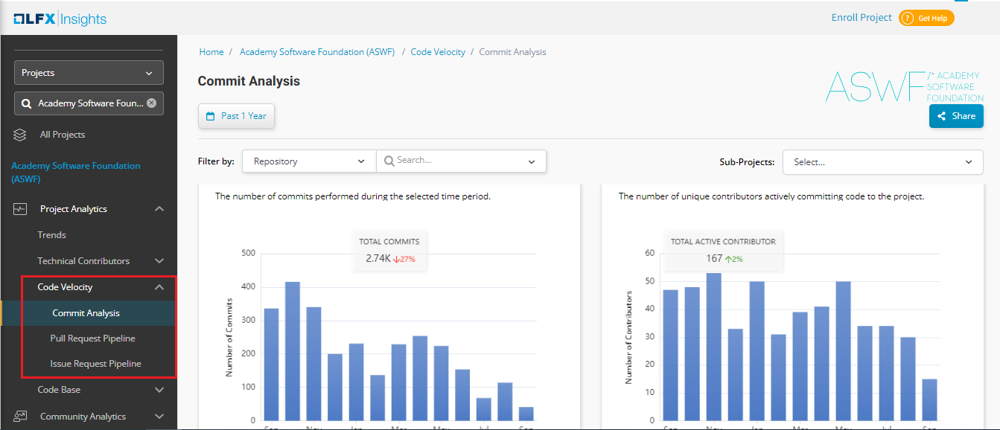

# Code Velocity

Code Velocity tab provides various insights related to the code that has been submitted by various contributors to the various open source project.&#x20;

Code Velocity tab provides insights on the following:

* Commit Analysis&#x20;
* Pull Request Pipeline&#x20;
* Issue Request Pipeline&#x20;

## Accessing Code Velocity

To access Code Velocity, perform the following steps:

1.Login to Insights.&#x20;

2.On the vertical sidebar navigation menu, click **Code Velocity**.

<figure><figcaption>
Code Velocity 
</figcaption></figure>

