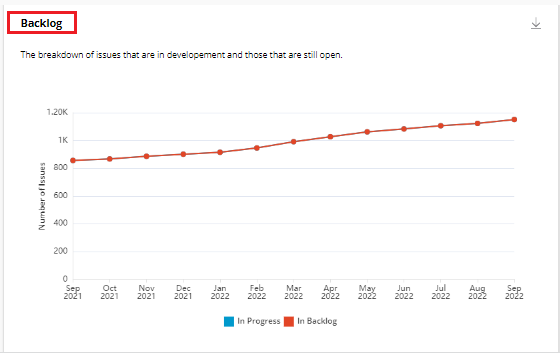
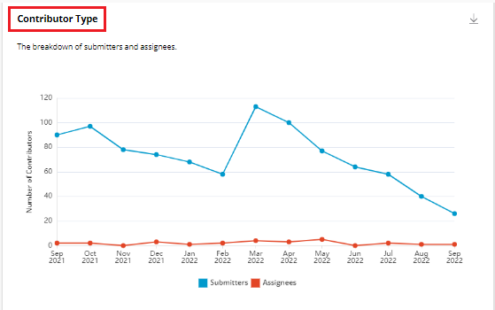
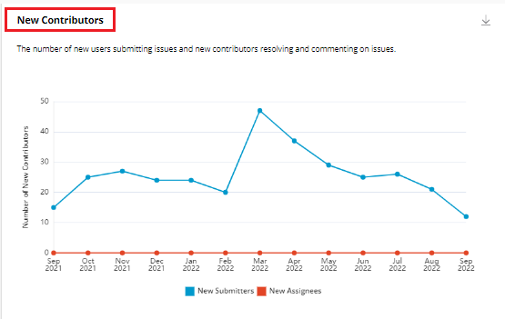
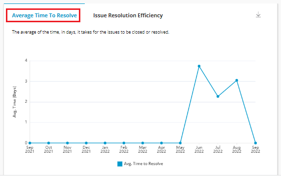
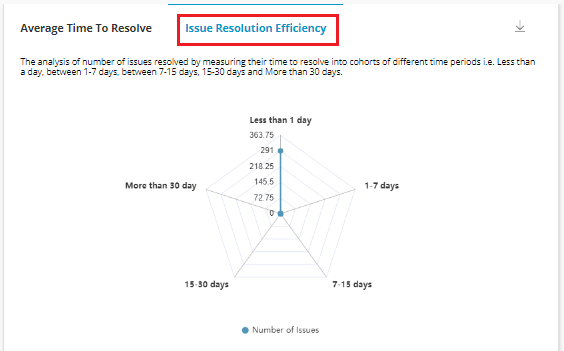
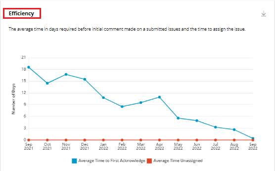
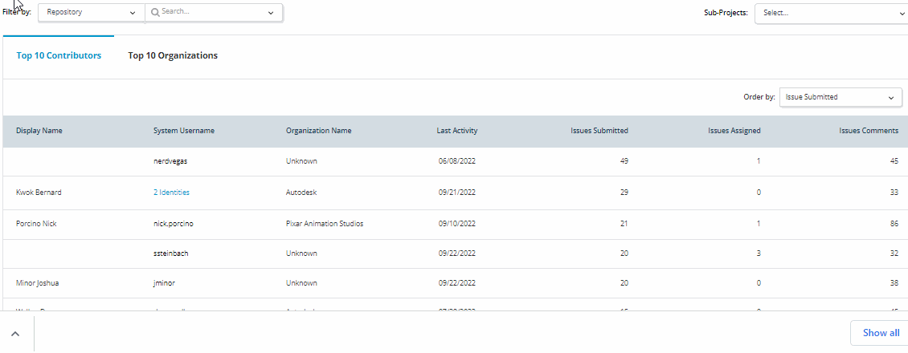

# Issue Request Pipeline

Issue Request Pipeline provides various insights related to issues raised and resolved for the open source project. Issue Request Pipeline provides various graphs that provides you information on issues.  There are various graphs such as:

* Issue History&#x20;
* Resolution Pipeline&#x20;
* New Issues
* Backlog
* Contributor Type&#x20;
* New Contributors&#x20;
* Average Time To Resolve&#x20;
* Issue Resolution Efficiency&#x20;
* Efficiency&#x20;
* Top 10 Contributors&#x20;
* Top 10 Organizations&#x20;

## Filter Data by Time Range

You can filter the data related to issues as per your desired date range. By default, time range is **Past 1 Year**. You can change the time range for a certain time period. For more information, refer [Date Range](https://docs.linuxfoundation.org/lfx/insights/v2-current/project-trends/filter-data-by-time-range).&#x20;

## Filters

You can filter the issues using various other filter like:

* Filter by&#x20;
  * Repository&#x20;
  * Repository Tags
* Searching by various individual repositories &#x20;
* Sub Projects


Every dashboard has a filter at the top of the dashboard to select either **Repositories or Repository Tags**. \
\
A Repository tag is a logical group created by clubbing two or more repositories under an org. One repository can belong to multiple repository groups. A repository tag is unique to a project.


<figure><figcaption>
Issues Filter 
</figcaption></figure>

## Download of Charts&#x20;

You can download all the charts that are displayed in the issues Pipeline page by click of the download icon that is provided on top of all the charts. The downloaded chart is saved on your local drive in the PNG format.&#x20;

## Issue History

This bar graph provides the aggregate number of submitted and resolved issues.


Since this is the aggregated count, the count will never go down.


<figure><figcaption>
Total Number of PR
</figcaption></figure>

## Observations&#x20;

Observations window provides various observations carried out on the Issue Request Pipeline. Some of the observations that are displayed are listed in the following list:

* The number of issues submitted increased by X% during the ${selected time period}.  /\* If the %increase is 0, the observation should say, No new issues were submitted during the ${selected time period}.
* An average of X issues were submitted submitted during the ${selected time period}.
* The number of issues resolved increased by X% during the ${selected time period}.  /\* If the %increase is 0, the observation should say, No new issues were resolved during the ${selected time period}.
* An average of X issues were resolved during the ${selected time period}.
* The highest growth in the number of issues submitted was seen between X-Y.
* Most number of issues were closed during the time period between X-Y.

## Resolution Pipeline

This funnel chart provides you the issue resolution pipeline showing bottlenecks and key data points such as issues waiting to be closed, commits pushed, pull requests submitted and more.

<figure><figcaption>
Resolution Pipeline 
</figcaption></figure>

## New Issues&#x20;

This bar graph provides you the trend of new issues submitted and resolved in a particular time frame.&#x20;

<figure><figcaption>
New Issues 
</figcaption></figure>

## Backlog&#x20;

This line chart provides you the breakdown of issues that are in development and those that are still open.

<figure><figcaption>
Backlog 
</figcaption></figure>

## Contributor Type

This line chart provides you the count of the total number of submitters and assignees over the selected time period.

<figure><figcaption>
Contributor Type
</figcaption></figure>

## New Contributors&#x20;

This line chart provides you the count of the total number of new submitters and new assignees over the selected time period.

<figure><figcaption>
New Contributors 
</figcaption></figure>

## Average Time To Resolve&#x20;

This line chart provides you the average time, in days, it takes for the issues to be closed or resolved during the selected time period.

<figure><figcaption>
Average time to resolve 
</figcaption></figure>

## Issue Resolution Efficiency

This radar chart provides you the analysis of number of issues resolved by measuring their time to resolve into cohorts of different time periods which is less than a day, between 1-7 days, between 7-15 days, 15-30 days and more than 30 days.

<figure><figcaption>
Issue Resolution Efficiency 
</figcaption></figure>

## Efficiency&#x20;

This line chart provides you the average time in days required before initial comment made on a submitted issues and the time to assign the issue.

<figure><figcaption>
Efficiency 
</figcaption></figure>

## Top 10 Contributors&#x20;

This list provides you the details of the top 10 contributors for the project in last one  year. The top contributor of the project is calculated based on the issues submitted on the project.&#x20;

This list provides various details such as:

* Display Name&#x20;
* System Username&#x20;
* Organization Name&#x20;
* Last activity&#x20;
* Issues submitted&#x20;
* Issues Assigned&#x20;
* Issue comments &#x20;


* You can order the list based on issues submitted, assigned and and comments.&#x20;
* On Click of **Active Contributor Leaderboard**, all the active contributors of the project are listed. &#x20;


<figure><figcaption>
Top 10 Contributors
</figcaption></figure>

## Top 10 Organizations

This list provides you the details of the top 10 organizations that contributing to the  the project in last one year. The top organization of the project is calculated based on the issues submitted on the project.&#x20;

This list provides various details such as:

* Organization name&#x20;
* Organization logo
* Industry&#x20;
* Active Issues Contributions&#x20;
* Issues submitted&#x20;
* Issues Assigned&#x20;
* Issue comments &#x20;


You can order the list based on Issue submitted, assigned and comments.&#x20;


<figure><figcaption>
Top 10 Organizations 
</figcaption></figure>
