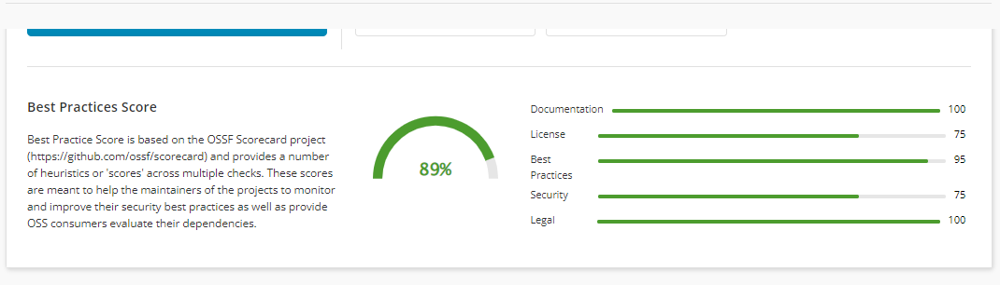
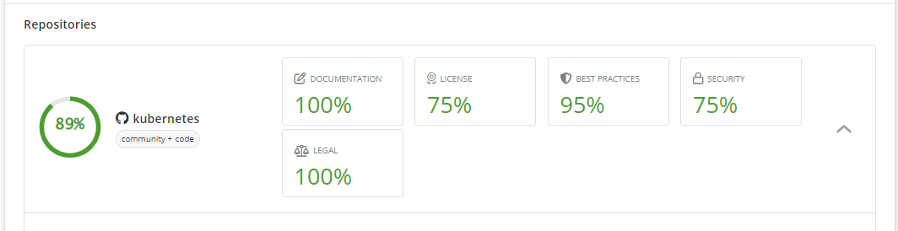
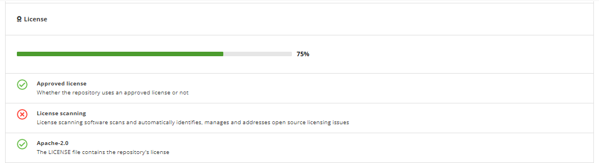

# Best Practices Score

The best practices health score is defined as the aggregated score based on the scores computed for each segment defined under the categories **Documentation**, **License**, **Best Practices**, **Security** and **Legal**. In calculating the final score, each component carries its own weight.

The weight of the segment is the sum of the weights of each check in that segment. A check is the best practice identifier as defined by the CNCF community. For more information, see [checks.](checks/)

<figure><figcaption>
Best Practice Score
</figcaption></figure>


The best practice score is calculated only for GitHub project repositories.


The default values for every check in a segment are defined [here](https://github.com/cncf/clomonitor/blob/d784f53c0e974c297707801ba3eff4739223b5b4/clomonitor-core/src/config.rs#L41).

For the computation logic of the scores, refer to the [code.](https://github.com/cncf/clomonitor/blob/d784f53c0e974c297707801ba3eff4739223b5b4/clomonitor-core/src/score/mod.rs#L229)

The best practices health score is calculated for each repository that is configured or enabled for the check. For instance, only the repository **Kubernetes** can be enabled for computing scores, excluding the rest of the repositories.&#x20;

<figure><figcaption>
Kubernetes
</figcaption></figure>

Click.png>) to expand and see the [`check sets`](checks/) for each segment.

<figure><figcaption></figcaption></figure>

