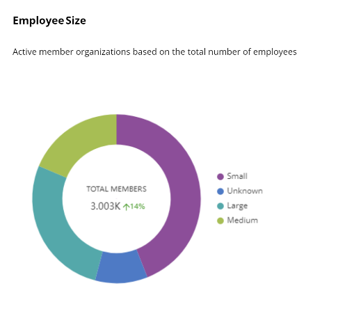

# Employee Size

The dashboard shows a doughnut chart that displays the segregation of the organizations based on their employee strength. You can analyze the active memberships of organizations by their current employee strength.


* If the organization's employee strength is less than 100, then the organization is considered small.
* If the organization's employee strength is between 100 and 999, then the organization is considered medium.
* If the organization's employee strength is greater than 1,000, then the organization is considered large.


The center of the donut chart shows:

* The total number of active members.
* The rate of change in the number of active members during the selected time period compared to the previous time period.


If the data from the previous period is unavailable or cannot be calculated, then do not show the percentage change in the center of the donut chart.


<figure><figcaption>
Active members as per employee strengths
</figcaption></figure>
