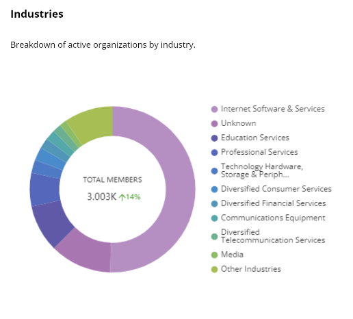

# Industries

The **Industries** dashboard shows a doughnut chart that displays the analysis of active members (organizations) by the different types of industries the active members belong to. Hover over the chart and you will see the different colors show the industry name and the number of active members that belong to the same industry.

The center of the donut chart shows the total number of active members with a change in the percentage of the count compared to the previous period.


If the data from the previous period is unavailable or cannot be calculated, then do not show the percentage change in the center of the donut chart.



**Other industries** in the list represent all other industry names that come after the top industries (by number of active members) as displayed in the list.


<figure><figcaption>
Industries as per active members
</figcaption></figure>
