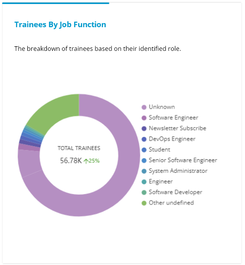

# Trainees By Geography and By Job Functions

This dashboard displays two interactive charts that display actively enrolled trainees based on their geo-locations and their job functions.

If you want to go back to the dashboard from any other screen, simply click the tab on the **Dashboard** to toggle between dashboards.

### Trainees by Geography

An interactive **Geo Locations** dashboard presents the geographical distribution of trainees and their drop rate. The Geo Location dashboard shows a map of the world combined with a heat map. The darker shade of color indicates a higher value for the metric.

The following metrics are available for analysis on the map:

* **Trainees:** the total number of trainees enrolled from different locations.&#x20;
* **Total learners for all programs :** the percentage increased or decreased in trainee enrollment for all programs compared to the previous time.

The world map with different colors for different regions (countries) represents how many individuals participated in the webinars, by country, that were organized during the selected time period. Hover over a color or a country to view the number of individuals who attended the webinars that were conducted during the selected time period.

<figure><figcaption>
Trainees from different geo locations
</figcaption></figure>

### Trainees by Job Functions

The **Trainees by Job Functions** dashboard shows the total number of individual learners enrolled in the training programs from different job profiles.&#x20;

This metric shows:

* A doughnut chart shows a visual analysis of the learners from the different job functions. Hover over the chart to view the total number and the respective job profiles of the learners enrolled.
* The increment or decrement rate of change in the total number of trainees during the selected time period compared to the previous time period.

<figure><figcaption>
Trainees based on their job profiles
</figcaption></figure>
