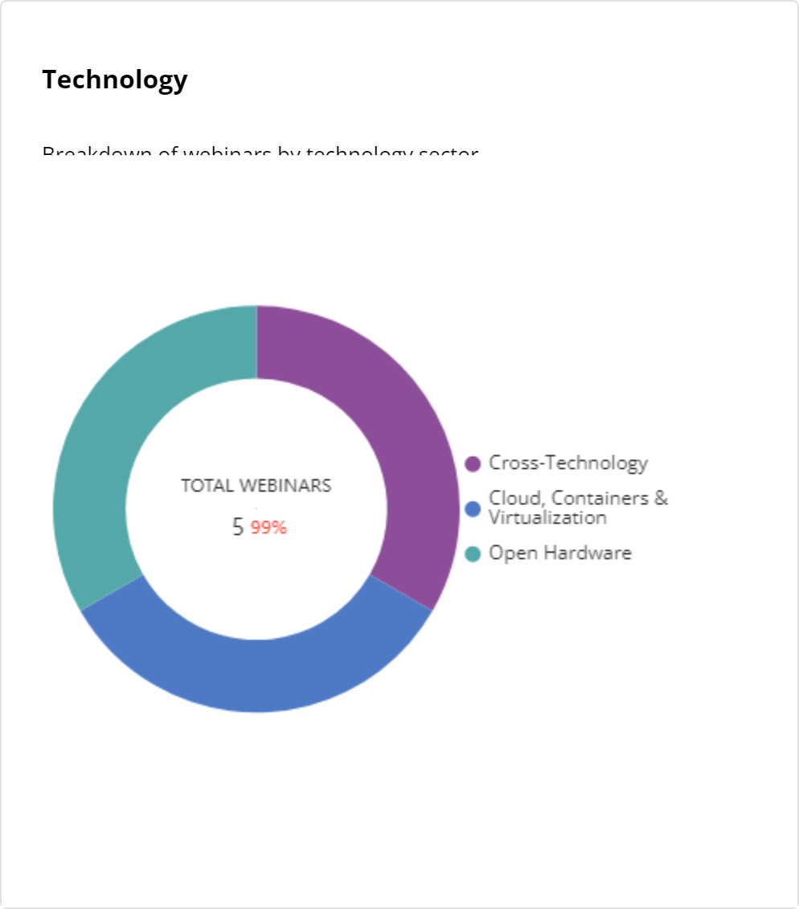

# Technology

The dashboard shows a doughnut chart that displays the total webinars conducted based on the top technology sectors yearly.  Hover over the colored chart to view the total number of webinars conducted for a particular technology.

It also shows:

* The total number of webinars conducted during the selected time.
* The name of the technology on which the webinars were conducted.

<figure><figcaption></figcaption></figure>

