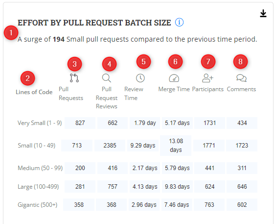

# Effort By Pull Request Batch Size

The **Effort By Pull Request Batch Size** metric analyzes the relationship between the size of pull requests (measured by lines of code changed) and the time contributors spend reviewing and merging them.

### Interact with the chart

<figure><figcaption></figcaption></figure>

### Why is this metric important?

* **Development Cycle Time:** The **Effort By Pull Request Batch Size** metric provides insights into the overall development cycle time. By analyzing the relationship between batch size and effort, you can identify trends that affect the time taken to review and merge pull requests.
* **Review Efficiency:** The **Effort By Pull Request Batch Size** metric helps project managers evaluate the efficiency of the pull request review process. By analyzing the effort required for different batch sizes, You can identify patterns and trends that impact the speed and quality of reviews.
