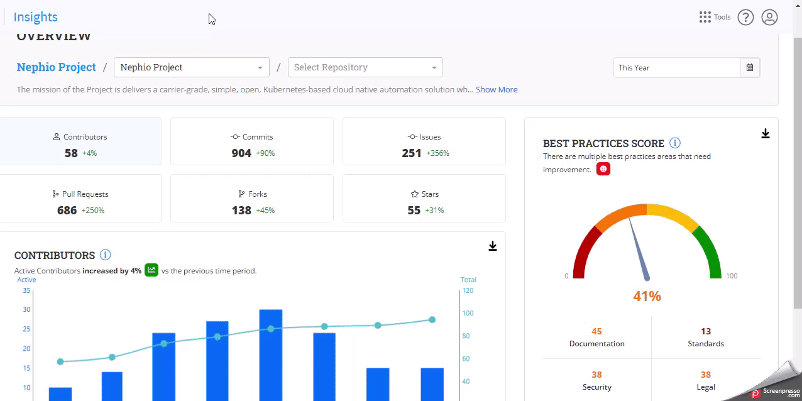

# Best Practice Score

A best practice score visualization is a tool that helps project leads and managers assess the overall health and quality of an open source software project.

It typically evaluates the project against a set of best practices or standards for software development, such as the categories **`Documentation`**`,`**`Standards`**`,`**`Security`**` `` `**`` Legal` and `Reliance` ``.**&#x20;

It generates a score or rating based on how well the project meets these criteria.

### Analyze the Dashboard

1. On the Overview page, select the project and repositories for which you want to see the best practice score.
2. Select the specific time period using the filter option.
3. Scroll down to find the best practice score dashboard.
4. You can see the aggregated score (3) and each category's score on the dashboard.
5. Click the **Download** icon .png>)to download the dashboard.&#x20;
6. Click on any category to see the expanded page where you can see the detailed analysis for each repository.

<figure><figcaption></figcaption></figure>

7. Click the **Create Issue** button to create an issue for each repository.

For more information, see [Best Practice Score](https://docs.linuxfoundation.org/lfx/insights/v2-current/all-projects/project-analytics/project-health-overview/best-practices-score).
