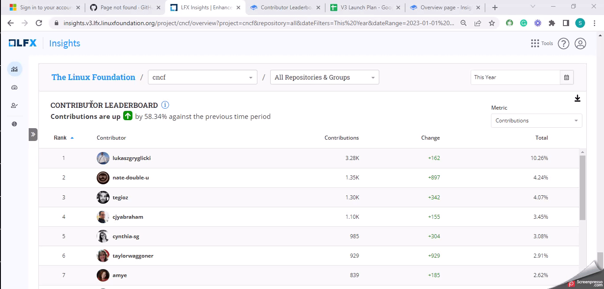

# Contributor Leaderboard

A **Contribution Leadership** board visualization displays the contributions made by individual contributors to an open source project. It ranks contributors based on the number of code commits, pull requests, issues closed, or other metrics and provides a visual representation of their relative levels of activity and impact on the project.

### Analyze the leaderboard

<figure><figcaption></figcaption></figure>

### Why is this metric important?

* **Recognition and Motivation:** The **Contributor Leaderboard** recognizes and acknowledges the efforts of individual contributors. It highlights their contributions, encourages ongoing engagement, and motivates contributors to continue their valuable work.
* **Community Engagement:** It creates a sense of community and healthy competition, encouraging collaboration and inspiring others to contribute and improve their ranking on the leaderboard.
* **Collaboration Opportunities:** The leaderboard helps project maintainers and community members identify potential collaborators or subject-matter experts within the project. It will be easier to identify the most active contributors and connect with them.
