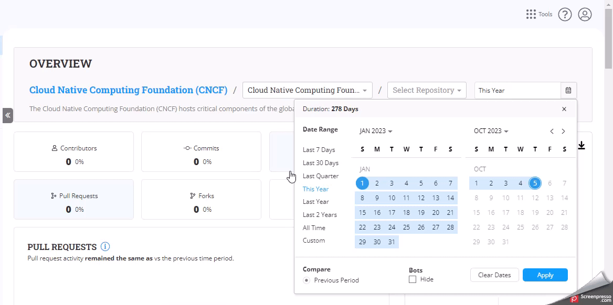

# Filter the Date Range

Within **Insights V3,** the "Filter the Date" feature allows you to customize your analytics view based on specific date ranges. This feature provides flexibility and control over the time period for which data is displayed.

Follow these steps to utilize the date-filtering feature:

1. On the right side of the analytics dashboard, locate the "Date Filter" section.&#x20;

<figure><figcaption>
Date Filter Icon
</figcaption></figure>

2. Click on the "Date Filter" section to expand the options.
3. Choose from the predefined date range options: Today, Last Week, Last 30 days, Last Quarter, Last Year, Last Two Years, or All Time.
4. Select the desired option by clicking on it.
5. Click the **Bots** checkbox if you want to hide the bots' data from the analytics.


The filter has **This Year** as a default time period.&#x20;


<figure><figcaption></figcaption></figure>

### Select Custom Date Range

1. To specify a custom date range, click on the **Custom** option within the date range selection menu.
2. On the calendar widget, select the start and end dates for your custom range.
3. The analytics dashboard will automatically update to display data within the selected custom date range.

### Apply the Date Filter

1. After selecting a predefined date range or setting a custom date range, click the **Apply** button to apply the date filter.
2. The analytics dashboard will refresh to reflect the chosen date range, displaying data only for the selected period.

### Modifying or Clearing the Date Filter

To display data for the entire available range and remove the date filter, click on the **Clear Dates** button.
