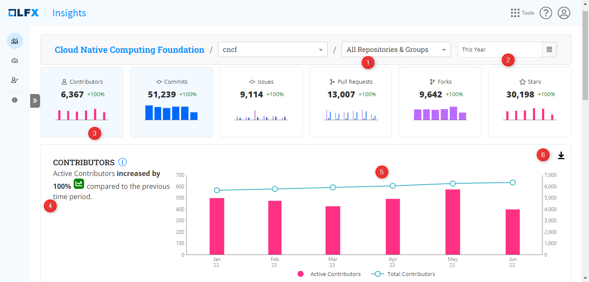

# Contributor

The data visualization on the overview page shows real-time data on the total number of contributors and the total number of [active contributors](../../glossary.md#active-contributors) across all monitored repositories during the selected time period.

Contributors activities:

Contributors can include individuals who actively participate in the development of the project and perform one or many activities:

* `issue-comment`
* `issues-closed`
* `issues-opened`
* `pull_request-closed`
* `pull_request-comment`
* `pull_request-merged`
* `pull_request-opened`
* `pull_request-review-thread-comment`
* `pull_request-reviewed`
* `committed-commit`
* `co-authored-commit`
* `authored-commi`

Cumulative chart description:

For example, you select a time frame `This year` which is 2023. If your project has 2,000 contributions before January 2023, and in January, if your project has 200 contributions, then at the end of January, your cumulative count is 2,200. In February, if your project has 300 contributions, then your cumulative count is 2,500.

### Interact with the chart

1. On the **Overview** page, select the project and repositories (1) for which you want to see the data.
2. Select the specific time period using the filter option (2).
3. The high-level tile (3) shows you the total unique contributors (calculated based on their member ID) for the selected time range.
4. The detailed analysis chart shows you the active contributors and the cumulative count of total contributors for the selected period. On the left side, the chart shows the chart trend summary (4). &#x20;

<figure><figcaption>
Contributors
</figcaption></figure>

5. Hover over the chart (5) to see the number of active contributors and the total contributors for the selected month.
6. This interactive download feature (6) enables you to download the chart in CSV and PNG file formats.

### Why is this important?

When you want to see the health of your open source project, the **Contributor Chart** is a crucial project performance indicator.

* Visualizing the number of contributors over time makes it easier to identify trends, patterns, and overall community interest. The trend helps project maintainers and other stakeholders act based on the charts.
* Tracking the number of contributors can provide insights into the health and vitality of your project.
* By analyzing changes in the contributor count, project managers can gain insights into the effectiveness of their community outreach and development strategies.

### FAQs

What happens if, for a single commit, there is an Author, Co-author, and a Committer?

In the contributors' dashboard, Individual roles are counted. In this case, we should count it as 3 contributors.

What occurs when a single Contributor raises a PR, additionally comments on it, and then merges it?

A single contributor performs many roles simultaneously, we count it as 1 Contributor.

If a unique contributor is performing multiple tasks, it is counted as 1 contribution.

