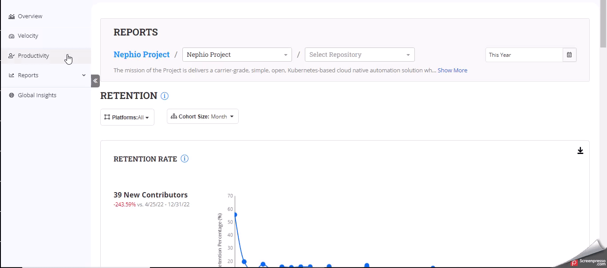

# Retention

#### Accessing the Retention Dashboard

1. Select the project from the landing page or the foundation page.
2. From the main navigation, select **Reports,** and click **Activities** Dashboard.

#### Interacting with the Charts

<figure><figcaption></figcaption></figure>

#### Select the Date Filter

1. On the top-right corner, locate the date filter option.
2. Click on it to open.
3. Choose your desired duration to focus on specific data.
4. Click **Apply** to update the dashboard with your selected date range.

#### Platforms Selection

1. Find the **Platforms** drop-down menu.
2. Choose a data source from the available options (e.g., GitHub or Git).
3. The dashboard updates to display insights relevant to your selected platform.

#### Cohort Size Selection

1. Locate the **Cohort Size** drop-down menu.
2. Choose either **Weekly** or **Monthly** to define the cohort size for analysis.
3. The dashboard adjusts to display data based on your selected cohort size.

#### Retention Rate Chart

The retention rate in open-source projects measures the percentage of contributors who continue to be actively engaged in the project over a specified period.

For a specific time period, the retention rate for contributors is calculated by dividing the number of contributors who remain active during the current and previous time period by the total number of contributors who were active in the previous time frame.

Formula to calculate retention rate

Here's a simple formula for calculating the contributor retention rate:

`Retention Rate = (Number of contributors active in current period/ Number of contributors active in previous period)*100`

Let's illustrate this with an example:

Suppose you're measuring contributor retention on a monthly basis for an open source project:

* In January, you had 100 contributors actively participating in the project.
* In February, 80 of those contributors remained active.
* To calculate the contributor retention rate for February, use the formula:

R.R = (80/100)\*100 = 80%

So, in this example, the contributor retention rate for February is 80%. This means that 80% of the contributors who were active in January continued to be active in February.

Suppose now out of 80 contributors in Feb, only 50 remained active in March:

&#x20;R.R = (50/80)\*100= 62.5%

1. Explore the **Retention Rate Chart** section.
2. Observe the chart that visualizes the retention rate of contributors over time.
3. This chart shows the percentage of contributors who continue to engage with your project over the defined cohort period.

#### Average Contributor Active Days

This metric provides insights into how consistently contributors are involved in your open source project over a specific period.

Example

Suppose you want to calculate the **Average Contributor Active Days** for the month of June. You have the following data:

* Contributor A was active for 20 days in June.
* Contributor B was active for 15 days in June.
* Contributor C was active for 10 days in June.

Total days contributed by all active contributors in June = 20+15+10= 45 days.

Total number of active contributors in June  = 3

Now, apply the formula:

Average Contributor Active Days =45/3 = 15 days

#### Average Number of Contributor Activities

1. Review the **Average Number of Contributor Activities** metric.
2. Gain insights into the average level of contributor activity within the defined cohort.

#### Retention Breakdown Step Chart

This chart helps you understand the retention of contributors over time. It provides insights into how many new contributors joined in a specific month and how many of them remained actively engaged in subsequent months.

