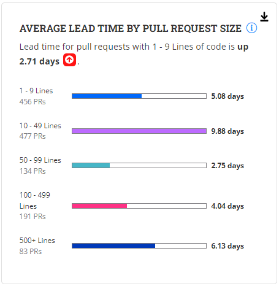

# Average Lead Time By Pull Request Size

**Insights V3** uses the **Average Lead Time by Pull Request Time** metric to provide insights into the time it takes for pull requests to be completed.

**Average Lead Time by Pull Request Time** refers to the average duration it takes for pull requests to progress from opening to merging. It measures the time span between the creation of a pull request and its successful inclusion into the project's codebase.

### Analyze the chart

The chart consists of five bars, each of a different color. Each bar displays the average lead time in hours/days for pull requests based on the pull request size.

<figure><figcaption></figcaption></figure>

We have five buckets of Pull Request Sizes. They are:

* &#x20;1-9 lines
* &#x20;10-49 Lines
* &#x20;50-99 Lines
* &#x20;100-499 Lines
* &#x20;500+ Lines

Pull Request Size is computed by Lines **Changed**. Lines changed could be lines of code added, deleted, or updated.

The length of the color inside the bar is determined by the average lead time. i.e., the longer it takes, the longer the length of the color inside the bar.


It is the "Average" Lead Time, so compute the average lead time for all PRs for a certain size and display the lead time in minutes/hours/days


### Why is this metric important?

* **Workflow Efficiency:** This metric provides valuable insights into the efficiency of the pull request workflow. Optimizing the lead time results in a faster integration of code changes and promotes collaboration among contributors.
* **Collaboration and Feedback:** It reflects the speed at which contributors receive feedback on their code changes. A shorter lead time indicates a more responsive review process, encouraging contributors to engage actively..
* **Project Velocity**: Monitoring the average lead time enables project managers to assess the overall project velocity. A shorter lead time helps maintain a high project velocity, ensuring rapid innovation and faster delivery of software features.

###

&#x20;
