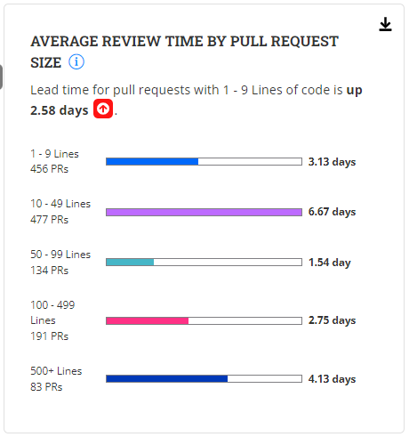

# Average Review Time By Pull Request Size

**Insights V3** uses the **Average Review Time by Pull Request Time** metric to provide insights into the duration it takes for pull requests to be reviewed.

**Average Review Time by Pull Request Time** refers to the average duration it takes for pull requests to be reviewed by peers or project maintainers. It measures the time span between the creation of a pull request and when it receives thorough review feedback.

### Analyze the chart

The chart consists of 5 bars, each of a different color. Each bar displays the average lead time in hours or days for pull requests based on the size of the request.

<figure><figcaption></figcaption></figure>

We have 5 buckets of Pull Request Sizes. They are:

* &#x20;1-9 lines
* &#x20;10-49 Lines
* &#x20;50-99 Lines
* &#x20;100-499 Lines
* &#x20;500+ Lines

Pull Request Size is computed by Lines "**Changed**". Lines changed could be lines of code added, deleted, or updated.

The length of the color inside the bar is determined by the average Review time. i.e., the longer it takes, the longer the length of the color inside the bar.

### Why is this metric important?

* **Code Quality Assurance:** The metric helps you monitor the speed at which pull requests are reviewed. By minimizing the average review time, you can enhance the chances of identifying and resolving code issues promptly, resulting in higher code quality and overall project success.
* **Collaboration and Engagement:** Prompt review feedback encourages active collaboration among contributors. It helps to maintain a responsive and interactive process. When pull requests receive timely reviews, contributors can address feedback and iterate on their code changes faster.
* **Project Velocity:** Timely code reviews contribute to higher project velocity. **The Average Review Time** metric provides insights into the responsiveness of the review process, identifying areas for improvement. Minimizing review times helps ensure that code changes are integrated swiftly, allowing projects to deliver new features or updates faster.

###

