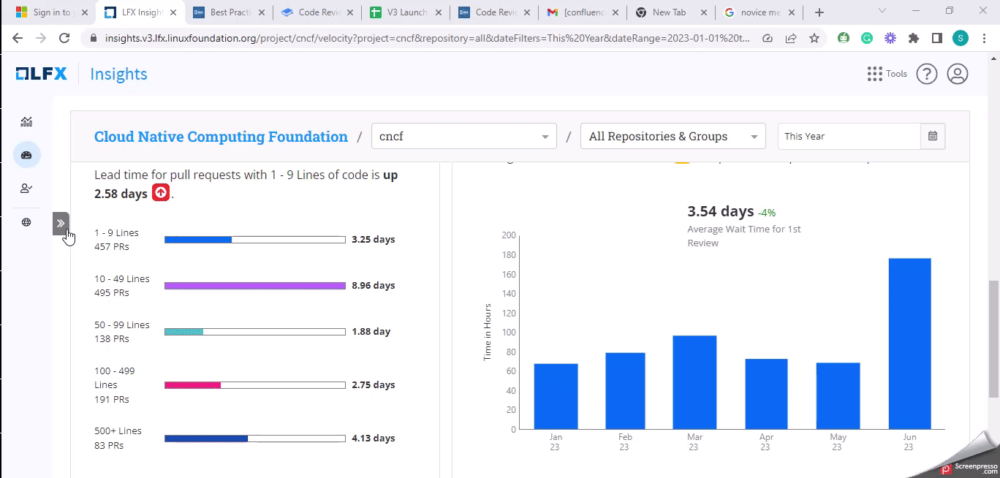

# Code Review Engagement

In **Insights V3**, the **Code Review Engagement** metric assesses the level of involvement and participation in code review activities.&#x20;

Following are the various factors that are considered in the Pull Request review process:

* Number of Pull Request Participants
* Pull Requests reviewed
* Review comments for Pull Request
* Code reviews

### Interact with the dashboard

<figure><figcaption></figcaption></figure>

### Why is this metric important?

* **Process Improvement:** Tracking the Code Review Engagement metric over time allows you to assess the effectiveness of code review processes and identify areas for improvement. Continuous improvement of the code review process leads to higher-quality code and improved productivity.
* **Quality Assurance:** Code review plays a vital role in ensuring code quality and identifying potential issues or bugs. By tracking this metric, managers can identify areas where additional attention or improvement may be needed to maintain high code quality standards.
