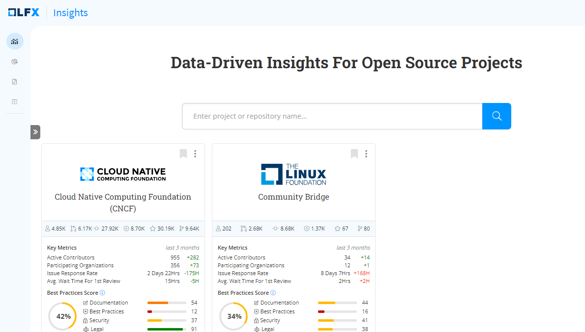

# Accessing Insights V3

To use the new Insights user interface, follow these steps:

1. Visit the[ Insights](https://insights.v3.lfx.linuxfoundation.org/) web URL and login if you have an existing LF account.
2. After logging in, you will be redirected to the **Insights** home page.
3. **The Insights** landing page consists of a navigation pane on the left and the main content area on the right.&#x20;
4. In the left-hand navigation pane, click any dashboard that you want to open.
5. The selected dashboard will be displayed in the main content area.
6. The **Insights Dashboard** is the default dashboard.

<figure><figcaption>
Insights Landing Page
</figcaption></figure>
