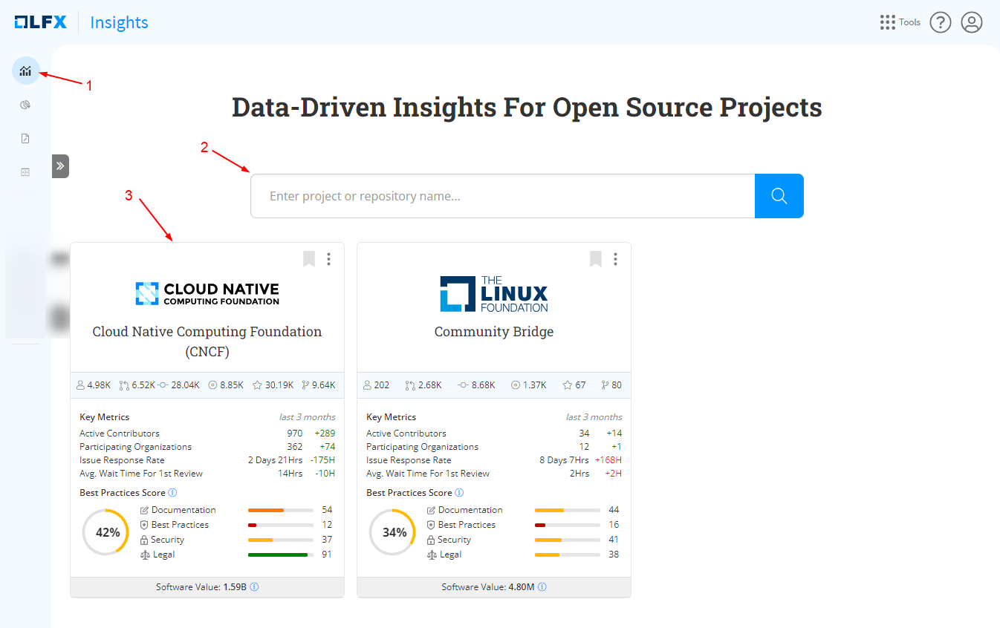

# Dashboard Overview

The **home page** provides you with all the important information about your analytics projects. It is designed to give you a quick overview of your data and help you navigate through the tool easily.

1. On the left side of the landing page, you'll find the navigation menus. These menus are like shortcuts that help you move around the tool.


On the left-side navigation menu, only the **Insights Dashboard** is active. Other menus are exciting features that will be integrated in the future.


<figure><figcaption></figcaption></figure>

2. **Select the Projects and the Foundations:** The search box at the top of the main menu helps you find a particular project or repository.

Search a particular project: 

1. To find a particular project, simply enter its name or relevant keywords into the search box.
2. As you type, the search functionality provides real-time suggestions based on your input, making it easier to identify the desired project quickly.
3. Once you find the project you're looking for, you can click on it to access its dedicated overview page.

3. **Project Cards:** On the main page, you will see the project cards. Each card represents an individual open source project. When you click on a project card, It takes you to a dedicated [overview page](../../overview-page/) for that project. These cards show you real-time data about each project, such as important numbers and updates.

