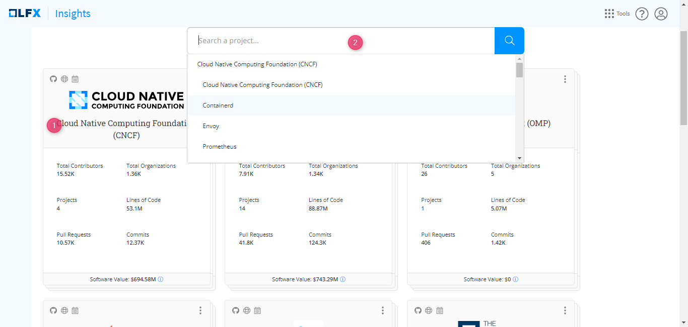
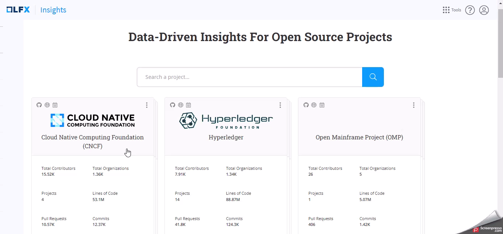
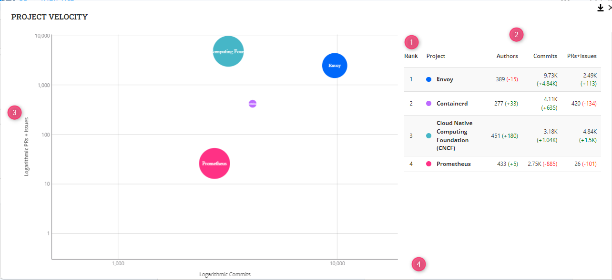

# Foundation Dashboard

#### Accessing the Foundation Dashboard

1. Click on a Foundation Card from the Landing Page or search for the foundation using the search box at the top.

<figure><figcaption></figcaption></figure>

#### Analyze the Foundation Dashboard

<figure><figcaption></figcaption></figure>

#### Key Metrics

At the top, you will see the following four high-level metrics:

1. **Organizations:** The metric shows the total number of organizations that have contributed to the projects within the foundation.
2. **Projects:** The metric shows the total project within the foundation.
3. **Contributors:** It shows the total number of contributors among all the projects within the foundation.
4. **Lines of Code:** Displays the total lines of code written for all the projects within the foundation.

#### Project Velocity Chart

Project velocity in open source projects refers to the rate at which development tasks are completed and features are delivered. It measures the amount of work completed in a specific amount of time.

A higher velocity suggests increased efficiency and progress, while a lower velocity may indicate challenges or bottlenecks.

Monitoring project velocity helps teams assess their performance and plan future tasks accordingly, ensuring steady project advancement.

The **Project Velocity** chart displays data from the last calendar year.&#x20;

<figure><figcaption></figcaption></figure>

How the project velocity is calculated?

The velocity is calculated based on the activity in the project. The logarithmic values of these metrics are used to normalize the data and make it easier to compare across different projects.

`The most common base for logarithms is 10. In this case, the logarithm gives you the power to which 10 must be raised to obtain the given number.`

`Example: log₁₀(100) = 2, because 10² = 100. In this case, the logarithm base 10 of 100 is 2, because 10 raised to the power of 2 equals 100.`

`Another example: log₁₀(1000) = 3, because 10³ = 1000.`

To compute velocity, the following metrics are used:

* Commits: Total number of commits
* Pull Requests: The number of pull requests opened
* Issues: The number of issues opened
* Contributors: The total number of contributors who made the above kinds of contributions (i.e. Commits, Pull Requests, Issues)

* Click .png>)icon to explore the chart.

<figure><figcaption></figcaption></figure>

1. On the Y-axis, there's a logarithmic scale representing PRs and Issues.
2. On the X-axis, there's a logarithmic scale representing commits.
3. The chart visualizes the correlation between code changes and collaboration.

#### Leaderboard: Project Velocity

1. Review the top projects based on their commit numbers.
2. Compare their commit count, PRs, and issues in a single view.

Definitions

* **Authors** are defined as a number of distinct commits/changesets authors across all project repositories.
* **Issues** value is defined as a number of distinct issues/bugs/emails (depending on data source type, like GitHub, Gerrint, Linux Kernel mail archives, etc.).
* **PRs** value is defined as a number of distinct Pull Requests/Merge Requests (depending on data source type).
* Chart uses the logarithmic scale number of commits for the X-axis, the logarithmic scale number of the sum of issues and PRs for the Y-axis, and the square root of the number of authors for the bubble size.

#### Project Cards

1. Below the charts and metrics, explore the project cards.
2. Each card represents a specific project within the foundation.
3. Project cards provide a snapshot of essential project details.

#### Interacting with Project Cards

1. Click on a project card to access the overview page that gives you more insights about that project.

#### Navigating Back

Click the  icon to return to the **Landing Page**.
