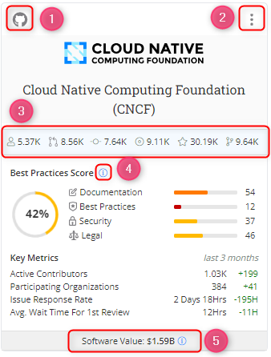

# Project Cards

On the landing page, the project cards are designed to show you real-time data and key metrics related to each project.

A Project card displays the following key metrics:

Key Metrics:

* Contributors
* Pull requests
* commits issues
* Stars
* Forks
* Active contributors
* Participating organizations
* Issue response time&#x20;
* Average wait time for 1st review
* Best practice score

### Interact with Project Cards

When you click on a project card, it opens up an overview page dedicated to that specific project. This overview page provides more detailed information about the project, such as in-depth analytics, charts, and other relevant data.

The Project Card has the following details:

1. **GitHub Icon:** Click the **(1)** GitHub icon to go to the GitHub repositories of the project.

<figure><figcaption></figcaption></figure>

2. **Download Icon:** click icon **(2)** to download the project card.
3. **Aggregated data:** it shows the real-time data of contributions, commits, PRs, issues, stars, and forks for the project.
4. **Info Icon:** shows the date and the time when the **Best Practise Score** was last updated.
5. **Software Value:** Constructive Cost Modal (COCOMO) is a procedural cost estimate model for software projects.
