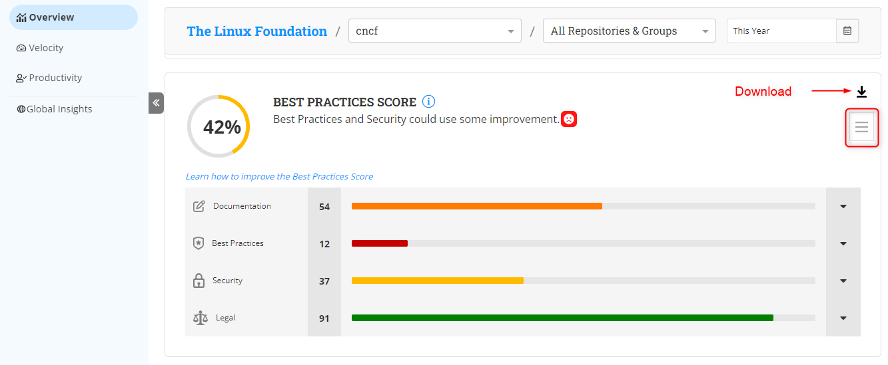

# Best Practice Score

A best practice score visualization is a tool that helps project leads and managers assess the overall health and quality of an open source software project.

It typically evaluates the project against a set of best practices or standards for software development, such as the categories**`Documentation`**`,`**`Best Practices`**`,`**`Security`**`` `and` ``**`Legal`.** It generates a score or rating based on how well the project meets these criteria.

### Analyze the Dashboard

1. On the Overview page, Select the project (1) and repositories for which you want to see the data.
2. Select the specific time period using the filter option (2).
3. Scroll down to find the best practice score dashboard.
4. You can see the aggregated score (3) and each category's score on the dashboard.&#x20;
5. Click the **Download** icon .png>)to download the dashboard.&#x20;
6. Click the Hamburger icon to get the badge.

<figure><figcaption>
Best Practice Score dashboard
</figcaption></figure>

7. Click  to expand each category and check the subcategories responsible for the practice score.

<figure><figcaption>
Sub categories
</figcaption></figure>

For more information, see [Best Practice Score](https://docs.linuxfoundation.org/lfx/insights/v2-current/all-projects/project-analytics/project-health-overview/best-practices-score).
