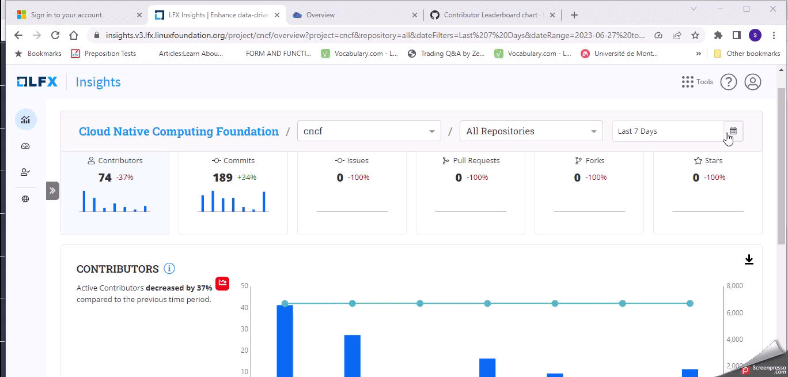

# Filter the Date Range

Within **Insights V3,** the "Filter the Date" feature allows you to customize your analytics view based on specific date ranges. This feature provides flexibility and control over the time period for which data is displayed.

Follow these steps to utilize the date-filtering feature:

1. On the right side of the analytics dashboard, locate the "Date Filter" section. It is represented by an icon and a drop-down menu.

<figure><figcaption>
Date Filter Icon
</figcaption></figure>

2. Click on the "Date Filter" section to expand the options.
3. Choose from the predefined date range options: Today, Last Week, Last 30 days, Last Quarter, Last Year, Last Two Years, or All Time.
4. Select the desired option by clicking on it.


The filter has **This Year** as a default time period.


<figure><figcaption></figcaption></figure>

