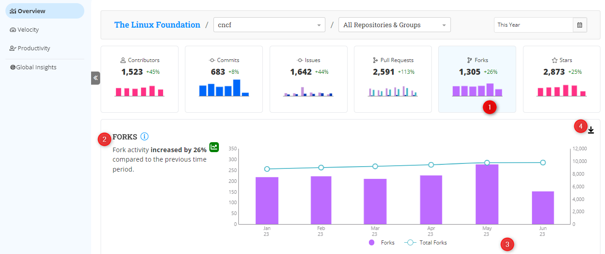

# Forks

The **Fork Metric** measures and analyzes the number of times a project has been forked by other developers.&#x20;

Forking is the process of creating a copy of a project's source code repository to either modify and enhance the project or use it as a starting point for a new project.

### Interact with the Chart

The bar chart on the dashboard represents the analysis, displaying the number of forks over time. Hover over a specific bar to access the detailed fork information for that particular month within the selected period.

The interactive download feature (Icon) enables you to download the chart in CSV and PNG file formats.

<figure><figcaption></figcaption></figure>

### Why is this metric important?

* **How popular is the project?:** The **Fork Metric** provides insights into the popularity of your project. A higher number of forks generally indicates that the developers find your project useful and valuable enough to build it or adapt it to their specific needs.
* **Code Reuse:** By analyzing the Fork Metric, you can get data on code reuse and identify potential opportunities for improvement.
* **Community Engagement:**  A growing number of forks indicates an active and involved community, contributing to the project's growth.
* **Project Evolution:**  By monitoring forks over time, you can identify significant milestones.

###
