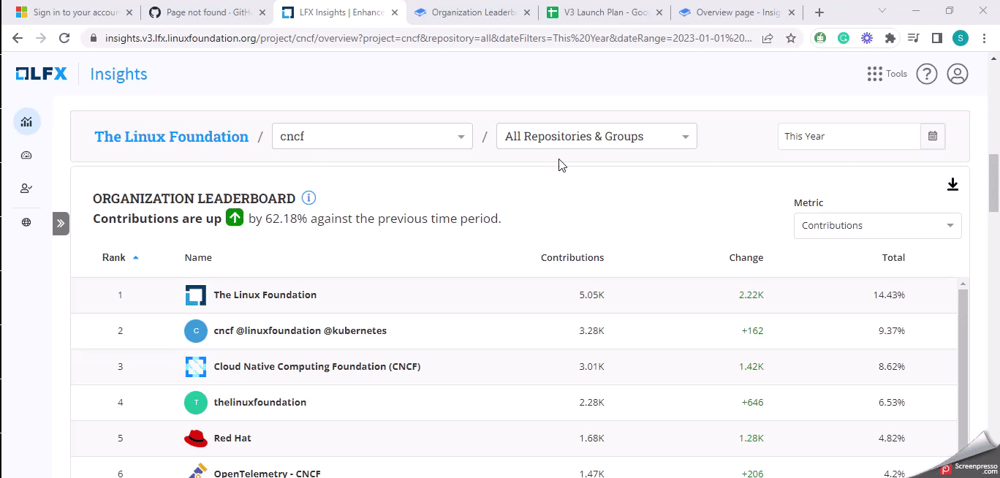

# Organization Leaderboard

The **Organization Leaderboard** ranks organizations based on their contributions to the project. The leaderboard provides insights into the collective efforts of organizations to drive the success and growth of your projects.

It helps you determine if your project has a healthy contribution from multiple organizations and if new organizations are coming to contribute to the project.

### Analyze the Leaderboard

<figure><figcaption>
Organization Leaderboard
</figcaption></figure>

### Why is this metric important?

* **Recognition:** The Organization Leaderboard recognizes and showcases the contributions made by various organizations.
* **Project Sustainability:** The Organization Leaderboard evaluates the involvement of organizations and assesses the project's long-term sustainability and growth potential.
* **Trust and Credibility:** When organizations are actively engaged in your projects and their contributions are recognized through the leaderboard, it enhances the overall trust and credibility of the project.

###
