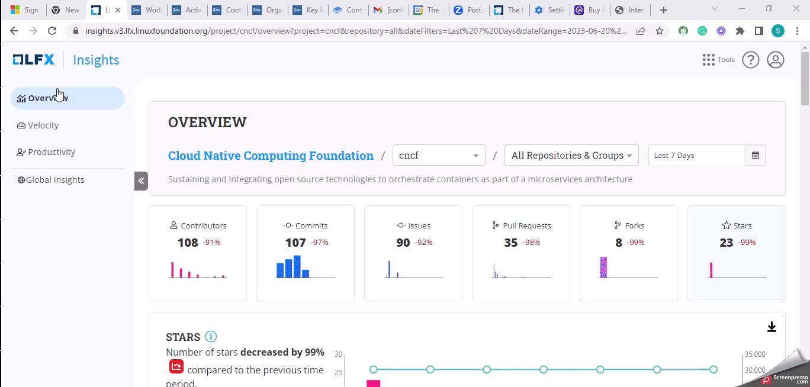

# Work Time Distribution

**Work Time Distribution** metric provides insights into the technical contribution breakdown across weekdays and weekends. It shows the time of day when most of the contributions happen so that you have maximum participation in the project. Each day is categorized by its level of activity, indicating low to high contribution levels.

Commits are recorded in the individual contributors' local time zone.&#x20;

Example

Commits are recorded in the individual contributors' local time zone. For example, if a contribution in the IST timezone commits a code at 10.00 AM IST on a Wednesday, and a contributor in the EST timezone commits a code at 10.00 AM EST on the same Wednesday, the Work Time Distribution Chart will display the commits at 10.00 AM Wednesday.


Only commits data is used for this dashboard.

**Commits**

* `committed-commit`
* `co-authored-commit`
* `authored commit`


### Interact with the chart

<figure><figcaption></figcaption></figure>

### Why is this metric important?

* **Activity Level Assessment:** Work Time Distribution allows you to assess the level of technical activity across different days of the week. By analyzing the chart, project managers can identify contribution patterns and trends, such as peak activity days or days with lower participation.
* **Productivity Monitoring:** Work Time Distribution helps you to monitor the productivity and engagement of contributors. By analyzing the breakdown of contributions, you can identify periods of high productivity and low engagement.
* **Work Optimization:** By understanding the distribution of contributions across weekdays and weekends, project managers can identify potential collaboration challenges due to varying availability.
* **Weekday vs. Weekend Contributions:** Compare the contribution levels between weekdays and weekends. Assess whether there are significant differences in activity levels, and identify any patterns or preferences in contributor engagement during these periods.
* **Maximum Participation:** As an Executive Director or Maintainer, when you want to set up a community call for your Project, you view the time when most of the contributions happen so that you can have maximum participation.

