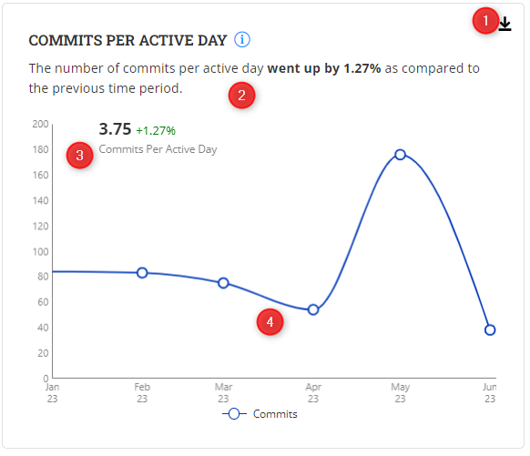

# Commits Per Active Day

The **Commits per Active Day Dashboard** provides insights into code commit frequency on active development days. It measures the average number of code commits contributors make on active development days.

### Analyze the chart

<figure><figcaption></figcaption></figure>

### Why is this important?

* **Early Issue Detection:** A higher number of commits per active day increases the likelihood of early issue detection. Regular code commits provide more opportunities for contributors to identify potential issues or bugs during the development process.
* **Code Quality and Stability:**  A consistent number of commits indicates ongoing code enhancements and maintenance, leading to improved code quality over time.
* **Productivity Assessment:**  A higher number of commits per active day suggests that contributors are actively working on code changes, implementing new features, fixing bugs, and making improvements.
