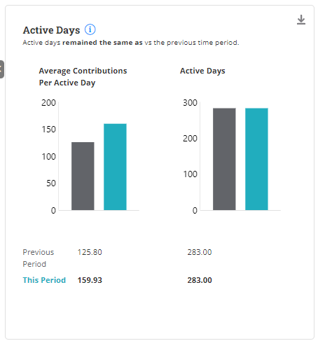

# Active Days

The **Active Days** metric measures the number of days a contributor has made at least one contribution to a project. It counts the number of days on which a contributor has been actively engaged in the project's development.

Active Days

Active Days counts the number of unique days in a given time frame when contributions (such as commits, pull requests, or issues) were made to your project.

A higher number of active days indicates a higher contributor engagement.&#x20;

<strong>Average Contributions per Active Day</strong>

It shows the average number of contributions (such as commits, pull requests, or issues) made to an open-source project per active day within a specific time frame.

This metric helps project maintainers and contributors understand the efficiency and effectiveness of their project's development process.

### Interact with the chart

The Active Day chart also displays two bars for the current data and the previous data, allowing you to compare them.

<figure><figcaption></figcaption></figure>

The Active Days dashboard provides you with the following insights:

1. You can monitor progress and identify trends. This information can be used to set goals and benchmarks for the project and measure success.
2. The active days metric provides a quick snapshot of the project's activity level. It helps determine whether the project is actively maintained or not.
3. The visualization can be used to quickly assess the activity level of a repository. A repository with a high number of active days is likely to be more active and healthy than one with a low number of active days.
4. By highlighting the importance of active days, project managers can encourage new contributors to become more involved in the project.
