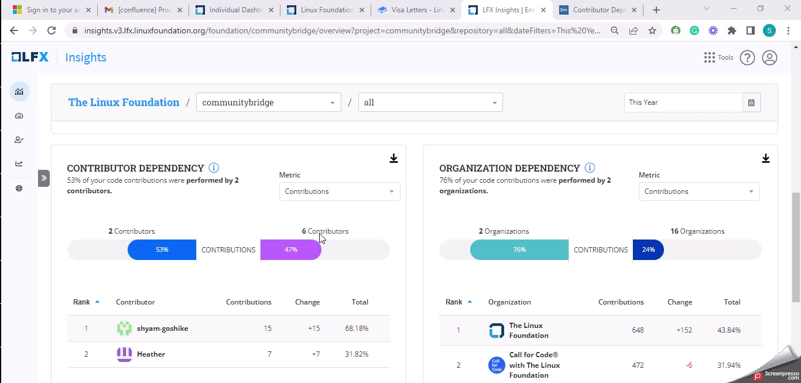

# Contributor Dependency

**Contributor Dependency** measures and analyzes the dependencies or relationships between different contributors within a project. It explores how contributors rely on each other, collaborates, and interact in terms of code contributions, reviews, and other collaborative activities.

Contributor dependency shows the relationship between contributors or entities within a project, where the actions or outputs of one contributor depend on the inputs or outputs of another.

### Analyze the chart

<figure><figcaption>
Contributor Dependency
</figcaption></figure>

### Why is this metric important?

* **Collaboration:** It identifies which contributors frequently interact, exchange ideas, review each other's work, and collaborate on code changes.
* **Knowledge Sharing and Expertise:** Understanding these dependencies can help project maintainers identify subject matter experts, encourage knowledge sharing, and allocate resources effectively.
* **Project Health and Sustainability:** By analyzing **Contributor Dependency**, project maintainers can evaluate the health and sustainability of the project. Dependencies that are concentrated around a few contributors may pose risks if those contributors become less active or leave the project.

###

