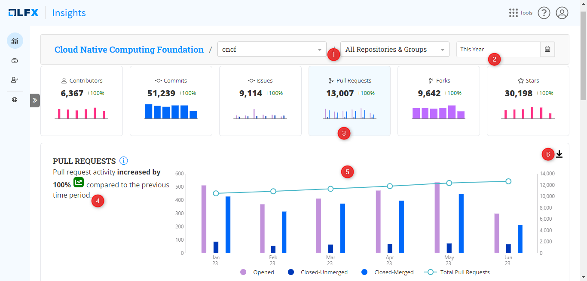

# Pull Requests

The **Pull Requests** **Metric** measures and analyzes the three key activities related to pull requests:

* Pull requests opened
* Pull requests closed
* Pull requests merged

Pull requests are a mechanism for proposing changes to a codebase, allowing developers to collaborate, review, and merge code changes into the project.

### Interact with the chart

Analyzing the high-level tile (1) representing unique pull requests (opened, closed, and merged) provides valuable insights into the health of the codebase.

The detailed chart displays data related to pull requests opened, closed-unmerged, closed-merged, and the total cumulative pull requests over the selected time period. On the left side, the chart shows the chart trend summary (4). &#x20;

<figure><figcaption></figcaption></figure>

### Why is this metric important?

* **Collaboration and Code Review:** It provides insights into the active participation of developers and the effectiveness of the code review process. If the number of Pull Requests opened is high, the user can complement this data with other Pull Request metrics such as first time **to Review**, and **Pull Request Cycle Time** to find out the cause of the high number of Pull Requests open but not acted upon/closed/merged.&#x20;
* **Community Engagement:** A higher number of pull requests indicates an engaged community that actively contributes to the project.
* **Quality and Maintenance:** By analyzing the number of pull requests opened, closed, and merged, you can assess the health of the codebase, identify areas that need attention, and ensure timely reviews and merging of contributions.

