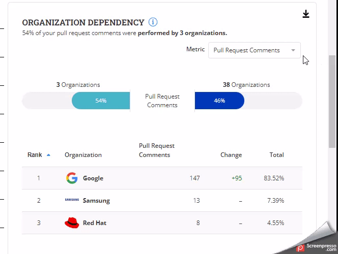

# Organization Dependency

**Organization Dependency** Metric shows the analysis of how much a project's contributions depend on or are associated with different organizations.

With Organization Dependency Metrics, you can assess which organizations are significantly contributing to your project.

### Analyze the charts

<figure><figcaption></figcaption></figure>

### Why is this metric useful?

* **Engagement Assessment**: For organizations involved in the project, this metric helps assess their level of engagement and impact. It can encourage healthy competition among contributors, resulting in greater involvement.
* **Risk Management**: Dependency on a single organization for contributions can be risky. If that organization reduces its involvement, the project might face challenges.

