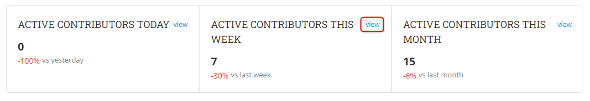
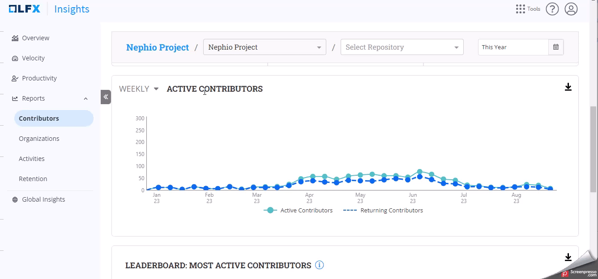

# Contributors Reports

The **Contributors'** reports provide insights into the individuals who have contributed to the project. This dashboard allows for the selection of data sources and provides specialized insights.

### Analyze the dashboard

<figure><figcaption></figcaption></figure>

#### Accessing the Dashboard

1. Select the project from the landing page or from the foundation page.
2. On the left navigation pane, click **Reports>Contributors**.

#### Date Filter

1. In the top-right corner, you will find the date filter option.
2. Click on the date filter to open a calendar.
3. Select the desired start and end dates for the data you want to analyze.
4. Click **Apply** to update the dashboard with the selected date range.

For more information, see [Filter Date Range](../overview-page/filter-the-date-range.md).

#### &#x20;Data Source Selection

1. Locate the drop-down menu for data source selection.
2. Choose the desired data source from the available options.
3. The dashboard will update to display data specific to the selected source.


Currently, both GitHub and Git are selected as the data sources by default.


<figure><figcaption></figcaption></figure>

#### Toggle Button for New Contributors

1. Locate the **Display Only New Contributors** toggle button.
2. Toggle it on to display data only for new contributors within the selected period.
3. Toggle it off to view data for all contributors.

#### Total Contributors Chart

1. Explore the **Total Contributors** chart section. When you toggle the **New Contributors** button, it displays the total new contributors.
2. Hover over the data points to view specific counts for that time.

#### Active Contributors Today/This Week/This Month

1. Explore **Active Contributors Today**, **Active Contributors This Week**, or **Active Contributors This Month** charts. The Charts are date filter independent. They show real-time data
2. Click **View** to expand the list on the right side and see the list of contributors.

<figure><figcaption></figcaption></figure>

#### Active Contributors vs. Returning Contributors

The chart shows new contributors when you toggle on the **Display Only New Contributors** Button.

Returning Contributors

Returning contributors in open source projects refer to individuals who have previously contributed to the project but are not currently active. On the other hand, active contributors are those who are currently engaged in ongoing contributions.

Returning contributors can potentially transition back to being active contributors if they choose to re-engage with the project.

1. Move to the "Active Contributors vs. Returning Contributors" chart.
2. click the drop-down to filter the data.
3. Understand the comparison between contributors who are active for the first time and those who have returned.

<figure><figcaption></figcaption></figure>

#### Leaderboard - Most Active Contributors

1. Navigate to the "Leaderboard" section.
2. You will find a list of the most active contributors.
3. Review their names and corresponding activity levels.
