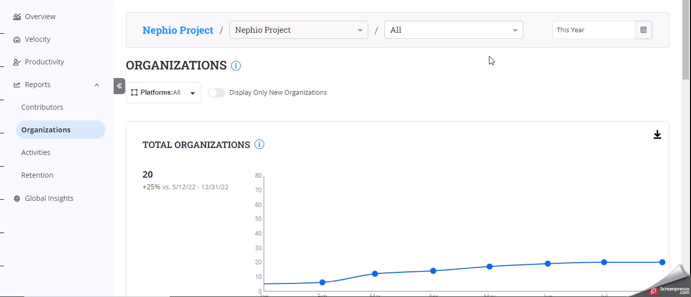

# Organizations Reports

The **Organizations'** reports provide insights into the individuals who have contributed to the project. The report gives you key metrics that you can use to assess a healthy contribution from multiple organizations.

### Analyze the dashboard

<figure><figcaption></figcaption></figure>

#### Accessing the Dashboard

1. Select the project from the landing page or from the foundation page.
2. On the left navigation pane, click **Reports>Organizations**.
3. Select the repositories from the drop-down menu to analyze the data for the particular repository.

#### Date Filter

1. In the top-right corner, you will find the date filter option.
2. Click on the date filter to open a calendar.
3. Select the desired start and end dates for the data you want to analyze.
4. Click **Apply** to update the dashboard with the selected date range.

#### &#x20;Data Source Selection

1. Locate the drop-down menu for data source selection. For more information, see Data Source Selection

