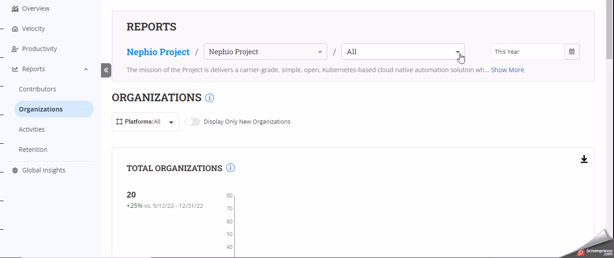
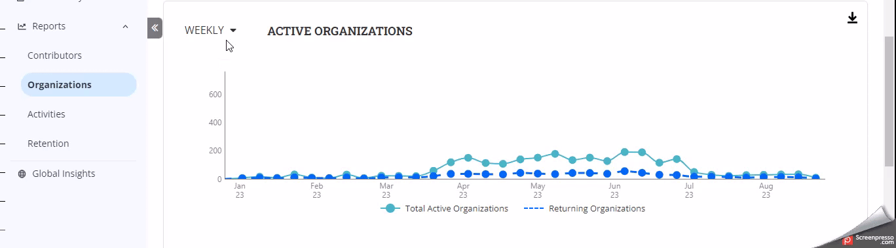

# Organizations Reports

The **Organizations'** reports provide insights into the individuals who have contributed to the project. The report gives you key metrics that you can use to assess a healthy contribution from multiple organizations.

### Analyze the dashboard

<figure><figcaption></figcaption></figure>

#### Accessing the Dashboard

1. Select the project from the landing page or from the foundation page.
2. On the left navigation pane, click **Reports>Organizations**.
3. Select the repositories from the drop-down menu to analyze the data for the particular repository.

#### Date Filter

1. In the top-right corner, you will find the date filter option.
2. Click on the date filter to open a calendar.
3. Select the desired start and end dates for the data you want to analyze.
4. Click **Apply** to update the dashboard with the selected date range.

#### &#x20;Data Source Selection

1. Locate the drop-down menu for data source selection. For more information, see [Data source platforms](https://docs.linuxfoundation.org/lfx/insights/v3-current/reports/contributors-reports#data-source-selection).

#### Toggle Button for New Organizations

1. Locate the **Display Only New Organizations** toggle button.
2. Toggle it on to display data only for new organizations within the selected period.
3. Toggle it off to view data for all organizations.

#### Total Organizations Chart

1. Explore the **Total Organizations** chart section. When you toggle the **New Organizations** button, it displays the total number of new organizations.
2. Hover over the data points to view specific counts for that time.

#### Active Organizations Today/This Week/This Month

1. Explore the **Active Organizations Today**, **Active Organizations This Week**, or **Active Organizations This Month** charts. The Charts are date filter independent. They show real-time data
2. Click **View** to expand the list on the right side and see the list of organizations.

#### Active Organizations vs. Returning Organizations

The chart shows new organizations when you toggle on the **Display Only New Organizations** Button.

Returning Organizations

<figure><figcaption></figcaption></figure>

#### Leaderboard - Most Active Organizations

1. Navigate to the Leaderboard section.
2. You will find a list of the most active contributors.
3. Review their names and corresponding activity levels.

