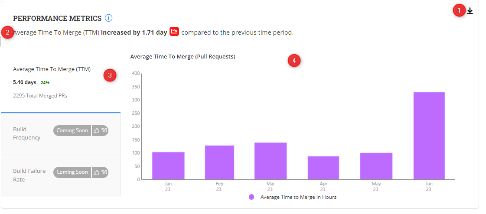

# Performance Metrics

**Insights V3** incorporates a **Performance Metric** to provide insights into key performance indicators such as time to merge pull requests, build frequency, and build failure rate.

The dashboard presents this information using a bar chart, allowing you to visualize and analyze these performance metrics over a selected time period.

### Analyze the Performance metric chart

The dashboard presents this information using a bar chart, allowing project managers to visualize and analyze these performance metrics over a selected time period.&#x20;

<figure><figcaption></figcaption></figure>

### Why is this metric important?

* **Time to Merge Pull Requests:** Evaluate the average time taken to merge pull requests. Identify any significant variations or trends in the time-to-merge, which can indicate potential inefficiencies in the code review and merge processes.
* **Build Frequency:** Assess the frequency of software builds. A higher build frequency signifies more frequent integration of code changes and adherence to continuous integration practices. A consistent and regular build schedule ensures rapid feedback and promotes collaboration among contributors.
* **Build Failure Rate:** Analyze the percentage of build failures. Higher build failure rates indicate issues in the build process, such as compilation errors, test failures, or compatibility issues. Identifying and addressing these failures promptly ensures a more stable and reliable software product.

###
