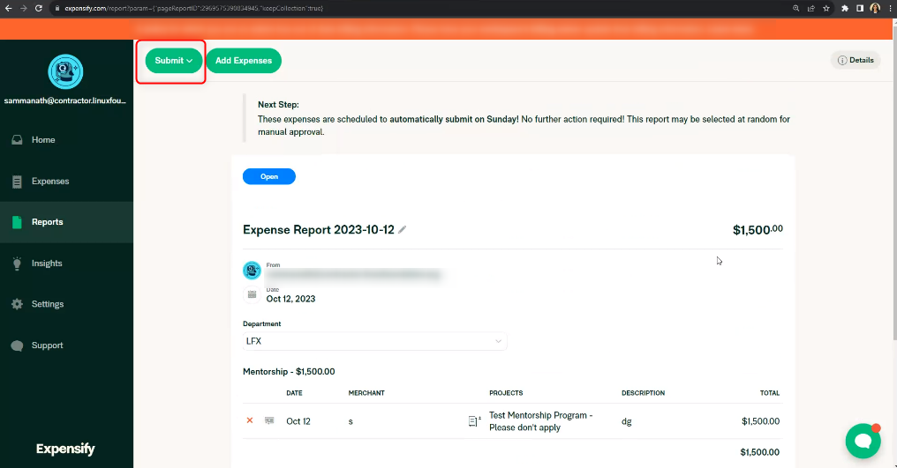

# Submit Expensify Report to Receive Mentorship Stipend

After receiving a successful performance evaluation, all mentees are required to submit an Expensify report to receive mentorship stipend payments. There are two stipend payments: the first one halfway through the mentorship and the second one upon successful completion of the program.

To create and submit an **Expensify Report:**

1. Sign in to [Expensify](https://www.expensify.com).\
   **Note:** Ensure that you use the same email address that you used to set up your account on Expensify.
2. &#x20;Under your account, select the **Reports** tab.

<figure><figcaption>
Reports page
</figcaption></figure>

3. On the **Reports** window, click **New Report** located in the top-right corner of the screen.

<figure><figcaption>
New Report
</figcaption></figure>

4. Click **Add Expenses** to create and add a new expense.

<figure><figcaption>
Add Expenses
</figcaption></figure>

5. Click New Expenses to create a new expense on the **Add Expenses To Report page**.

<figure><figcaption>
New Expense
</figcaption></figure>

6. Create a new expense by completing the fields as follows:

* **Merchant:** Your name
* **Date:** Date of the stipend payment (today's date)
* **Total:** 50% of the total amount of your stipend payment for midterm and final evaluation periods.
* **Category:** Select **Mentorship** from the dropdown list.
* **Projects:** Search and select the appropriate mentorship program for which the mentee has been accepted.
* **Description:** Name of your mentorship - mentee stipend payment <#> of <#> `For example: "Linux Kernel - mentee stipend payment 1 of 2"`

<figure><figcaption>
Select your project
</figcaption></figure>


**Important: International mentees not residing in the US:** please add "International Bank” after your name. The Linux Foundation will use the details on the **Wire Transfer Form** you submit to pay your stipend.

1. Download the **Wire Transfer Form** found below.
2. Fill in all the required information. It must be hand-written.
3. Upload and attach the form as a receipt with your report.




7. Click **Save.**

<figure><figcaption>
Save
</figcaption></figure>


**Note:**

1\. **United States residents:** please add the US bank deposit account to Expensify when first setting up the Expensify account.


8. After being redirected to the Reports page, click **Submit** from the top left corner.

<figure><figcaption></figcaption></figure>

8. (Optional) Provide an individual's email address in the **CC** field if you want to share the report with the individual.
9. Click **Send**.


If you reside in the United States, add a U.S. bank deposit account to Expensify by navigating to **Settings** > **Account** > **Payments** > **Bank Accounts** as shown below.



**IMPORTANT:** It may take up to 30 business days for the funds to be processed via wire transfer and released by a bank outside the United States.&#x20;

The process can take even longer than expected if you have not provided your bank details or if the information that you have provided is incorrect.

