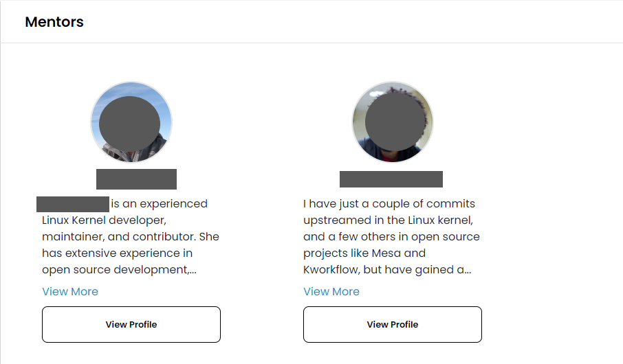

# View Mentorship Program Details

To view program details, navigate to the [Mentorship](https://people.communitybridge.org/profile) platform, and under the Mentorships tab, select the program you would like to view.

<figure><figcaption>
Mentors
</figcaption></figure>

<figure><figcaption>
Meentee's profile
</figcaption></figure>

<figure><figcaption>
Graduate Mentee's profile
</figcaption></figure>

On the program detail page, you can view the following information, depending on the available data:

| **Name**                                                                                                                                          | Description                                                                                                                                                                                                                                                                                                        |
| ------------------------------------------------------------------------------------------------------------------------------------------------- | ------------------------------------------------------------------------------------------------------------------------------------------------------------------------------------------------------------------------------------------------------------------------------------------------------------------ |
| 
<strong>CII Badge</strong>

 | Indicates project's participation in the [Core Infrastructure Initiative (CII) Badge Program](https://www.coreinfrastructure.org/programs/badge-program/). A CII badge means the project is self-certified and follows best practices for secure open source development. Click on the badge to view more details. |
| **Mentees**                                                                                                                                       | Avatars of the current mentees                                                                                                                                                                                                                                                                                     |
| **Terms**                                                                                                                                         | Current term(s)                                                                                                                                                                                                                                                                                                    |
| **Sponsors**                                                                                                                                      | Logos of companies that are sponsoring mentee stipends.                                                                                                                                                                                                                                                            |
| **Mentors**                                                                                                                                       | Avatars of the mentors                                                                                                                                                                                                                                                                                             |
| **Project Skills**                                                                                                                                | Skills required in order to apply to the mentorship program                                                                                                                                                                                                                                                        |
| **View Repository**                                                                                                                               | Link to project GitHub repository                                                                                                                                                                                                                                                                                  |
| **View Site**                                                                                                                                     | Link to relevant website                                                                                                                                                                                                                                                                                           |
| **Code of Conduct**                                                                                                                               | Link to project's code of conduct.                                                                                                                                                                                                                                                                                 |
| **Apply/Applications Closed**                                                                                                                     | CTA button to apply to the mentorship program. The CTA is disabled when program no longer accepts mentee applications                                                                                                                                                                                              |
| **View Crowdfunding**                                                                                                                             | The CTA button takes you to the crowdfunding platform to make donations to the mentorship program                                                                                                                                                                                                                  |

**The Mentors** section contains mentor profile cards, click on **View Profile** to navigate to the mentor's profile page.

Mentee profile cards can be found in the Mentees section; click View Profile to go to the mentor's profile page.

**The Graduated Mentees** section contains profiles of the mentees who successfully completed the project's mentorship program, click on **View Profile** and navigate to the mentor's profile page.
