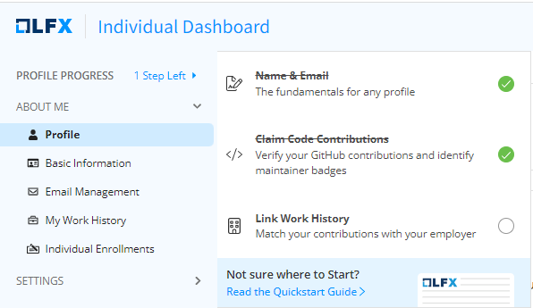
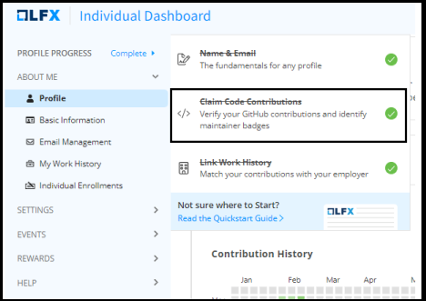
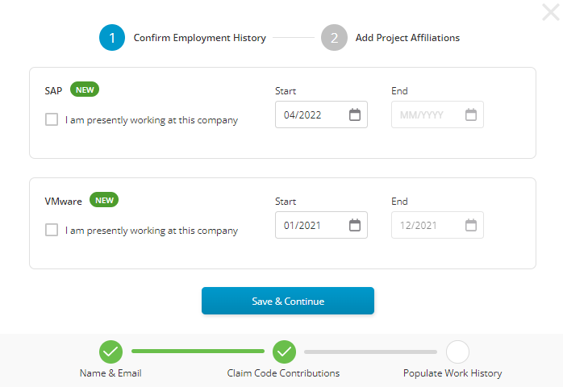
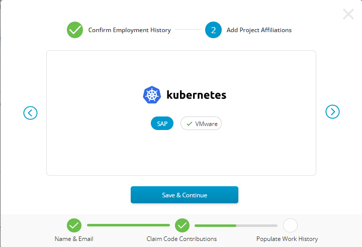
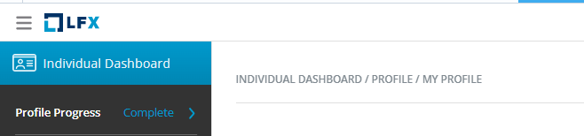
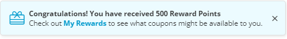

# Complete your LFX Profile

Your LFX Profile is your entry point to our open collaboration portal. To avail the discounts on training and certifications, you need to complete your profile. Once you complete your profile, you can:

* showcase your open-source participation.
* access all of our LFX tools
* review your open-source meeting recordings and transcripts
* earn rewards
* and more

To set up your LFX profile, you need to complete the following 3 steps:


You can see your profile completion progress on the left-navigation pane of the individual dashboard.


<figure><figcaption>
Profile Completion Status
</figcaption></figure>

1. When you create your LF account and enter your Name and Email addresses, you complete the first step.&#x20;
2. Click **Claim Code Contributions** to link your GitHub account to verify your contributions and identify your maintainer badges**.** You can continue to connect your LinkedIn account and complete step 3 or follow the next step.

<figure><figcaption>
Claim Contributions
</figcaption></figure>

3\. Click **Link Work History** to connect your LinkedIn account and link your work history. After connecting to your LinkedIn account, confirm your employment history and add your project affiliations.

<figure><figcaption>
 Employment History
</figcaption></figure>

4\. Click **Save & Continue** to add your project affiliations**.**

<figure><figcaption>
Project Affiliations
</figcaption></figure>

5\. Click **Save & Continue**. On the next page, If you have contributed to open source using any other email addresses, add them here.

<figure><figcaption>
Other Emails
</figcaption></figure>

6\. Click **Done**. Now that your account has been set up, you’re all set to start collaborating.

<figure><figcaption>
Complete Profile
</figcaption></figure>

Upon successful completion, you will receive a notification of your reward points.

<figure><figcaption>
Reward Points
</figcaption></figure>

On the top right corner of the **Individual Dashboard,** you will see the **Tools** menu. Click to explore our other LFX tools such as; Insights to learn about projects you care about, mentorship to increase your impact as a mentor, or learn about open source as a mentee, or Security.



