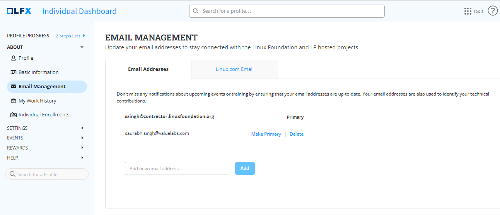

# Email Addresses

On this page, you can add all your email addresses that help in identifying all your technical contributions. Updating your email addresses keeps you informed of upcoming events and training opportunities.&#x20;

Follow these steps to add your email addresses:

1. Enter your email address in the text box, and click **Add.**
2. After adding your email address, you will receive a verification notification on your email address.
3. After verification, your email address will be displayed on this page.
4. Click the **Make Primary** button to make one of your email IDs a primary email ID.&#x20;


A maximum of 10 email addresses can be added to this page.


<figure><figcaption>
Email Management
</figcaption></figure>
