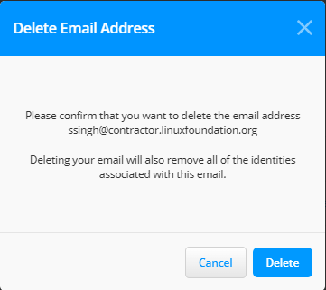

# Email Preferences

On this page, you can add all your email addresses and manage your communication settings that help identify all your technical contributions. You can customize your email settings for different purposes, such as login and basic communication, as well as meeting invitations.&#x20;

### Add an Email address

Follow these steps to add your email addresses:

1. Navigate to **Settings > Email Management** .
2. On the **EMAIL MANAGEMENT** page, Enter your email address in the text box and click **Add.**

<figure><figcaption></figcaption></figure>

2. After adding your email address, you will receive a verification notification on your email address.
3. Once you verify your email address, it will be displayed on this page.


A maximum of 10 email addresses can be added to this page.


<figure><figcaption>
Email Management
</figcaption></figure>

### Manage your communication preferences

Follow this step-by-step procedure to efficiently manage your email preferences:

1. On the **EMAIL MANAGEMENT** page, you will see a list of email addresses associated with your account.


If you have added only one email address, then by default the same email address will be used for Primary and meeting invitations.


3. Click on the radio button next to the chosen email address for Meeting Invitations. A checkmark should appear, indicating your selection.

<figure><figcaption></figcaption></figure>

4. After selecting your preferences, you will receive the following email at your preferred email address.

<figure><figcaption></figcaption></figure>


If you change or modify your email preferences from one email to another, you will get a notification on your old email address.


5. To change your primary email, repeat the above steps.

### Delete your Email address

1. To delete your email address, click **Delete** next to the chosen email address.


You can only delete the email address that you have not selected for any communication preferences. If you have selected your email ID for Primary or for meeting invitations, you cannot delete that.


<figure><figcaption></figcaption></figure>

2. On the pop-up window, click the **Delete** button.

<figure><figcaption></figcaption></figure>

### **Troubleshooting**

If you encounter any issues or do not receive the expected emails, ensure the chosen email addresses are valid and properly configured. If you still face the same problem, contact the [support team](https://jira.linuxfoundation.org/plugins/servlet/desk/portal/4/create/255).
