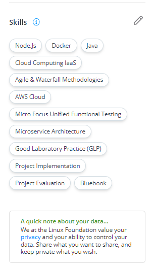

# Upcoming Events, Badges and Skills

From the right side pane of the window, you can view the upcoming events that you have registered for, the badges that you have earned, and your skill sets.

### 1. Upcoming Events

Use this section to register for upcoming open-source events hosted by the Linux Foundation. If you are already attending an event, turn on the “Connect with me” networking option to let other community members book a meeting with you.

If you have not registered for any event, then click the **Explore Upcoming Events** CTA button, and register for the LF-hosted events.

### 2. Badges

The **Badges** pane shows the digital community badges that you have earned. Your expertise may be published on LFX Insights Community Dashboards and Organization Dashboards, recognizing your efforts.&#x20;


In the future, you can add non-Linux Foundation badges to your profile. Community badges are generated from the following sources:


Digital badges are generated from the following sources:

* For the Linux Foundation **Certifications,** you have successfully passed.
* For speaking engagements at various Linux Foundation **Events** or participation in program committees for these events.
* Individual enrollments to projects.

**Note:** Clicking on a badge will take you to the _Certification Verification_ page where you can see to who the badge has been issued, and you can verify the badge.

### 3. Skills

Using this section, you can highlight your skills in open source and also become a mentor for people who want to follow you and learn from you. Your expertise may be published on LFX Insights and LFX Mentorship, recognizing your efforts.

#### Add or Remove Skills

To add or remove your skill sets:

1\. Log in to [https://openprofile.dev](https://openprofile.dev).

2\. From the right-side pane of the window, scroll down to the **Skills** section and click .png>) icon.

<figure><figcaption>
Add Skills
</figcaption></figure>

3\. On the **Skills** subpage, click **+Add Another Skill,** type your skill set in the search box, and select the skills from the displayed list.

<figure><figcaption>
skills  box
</figcaption></figure>

4\. To remove or edit a skill set, click the pencil icon, and then click the cross mark next to an added skill.

3\. On the **Skills** subpage, enter your skill set and select the skill from the displayed list.

4\. Click **+Add Another Skill** to add another skill to the list.

