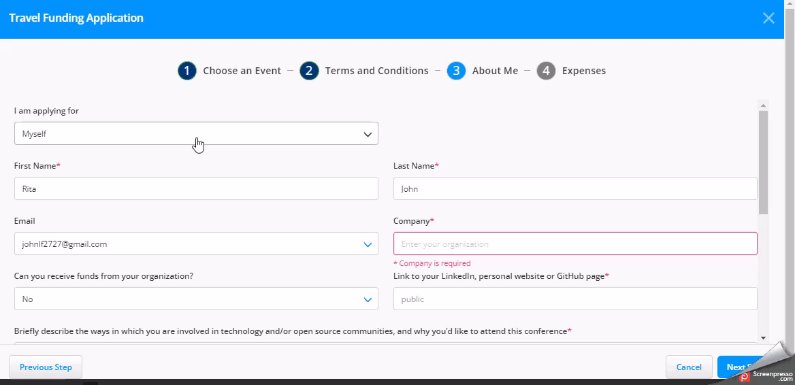
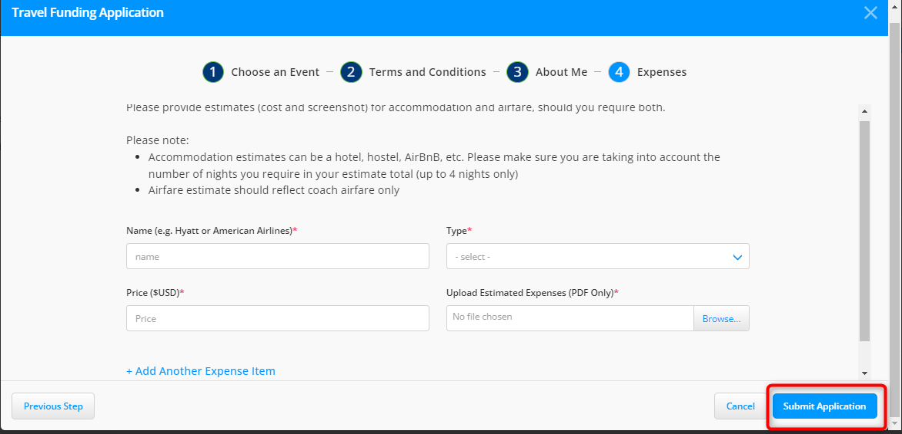

# Travel Funding

A travel funding request is a formal request made by an individual or group to a funding source, such as an employer or organization, to pay the expenses of attending an event, such as travel, accommodation, meals, and registration fees.

* The request includes a detailed budget and justification for the request.
* The funding source assesses the request based on various factors, including budget and significance to their objectives.
* The decision to approve or deny the request depends on the funding source's evaluation of the request.

To apply for the new fund requests, follow these steps:

1. Navigate to the [Individual Dashboard](https://openprofile.dev/) login page.
2. Enter your login credentials and sign in. For more information, see the [Sign in to Your Account](https://docs.linuxfoundation.org/lfx/sso/sign-in) page. If your login credentials are correct, you will be directed to the main dashboard or home page of the web UI.
3. From the left-side navigation pane, navigate to **EVENTS>LF Events**.
4. On the **MY EVENTS** page, click the **Travel Funding** tab. Click the **New Funding Application** CTA to access the application page.

<figure><figcaption>
New Funding Application
</figcaption></figure>

&#x20; 5\. On the **Travel Funding Application** page, scroll down and check the event that you want to attend. Click the **Select** button to choose the event. After selecting the event, click **Next**.

<figure><figcaption></figcaption></figure>

> <pre><code><strong>You can select the event by using the Filter by Name, Time, and Location search buttons given at the top of the Travel Funding Application Page.
> </strong></code></pre>

6\. On the **Terms and Conditions** page, read the terms and conditions for the visa application and click **Next**.

> * Click the **Cancel** button if you want to cancel your new travel fund application.
> * Click the **Previous Step** button to go back to the event selection page.
> * For questions, please contact [travelfund@linuxfoundation.org](mailto:travelfund@linuxfoundation.org).

7\. On the **About Me** page, fill out the following information to complete the application. Click **Next Step**.

<figure><figcaption></figcaption></figure>

8\. Click **Next Step.** On the **Expenses,** fill in your expense details and submit the application.

<figure><figcaption></figcaption></figure>

### Travel Fund Request Status 

Once you submit your request, you can see your application status on the **Travel Funding** page. \

<figure><figcaption></figcaption></figure>

Once your request is approved by the event team, you can see the status change as **Approved** on the **Travel Funding** page**.**
